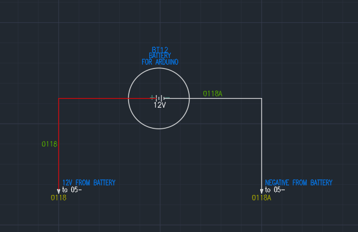
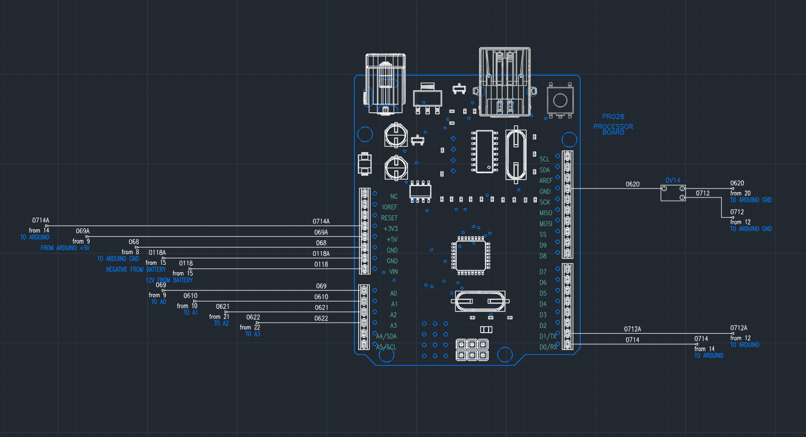
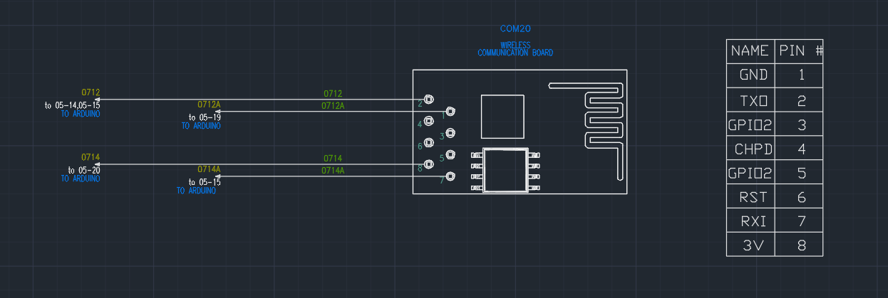
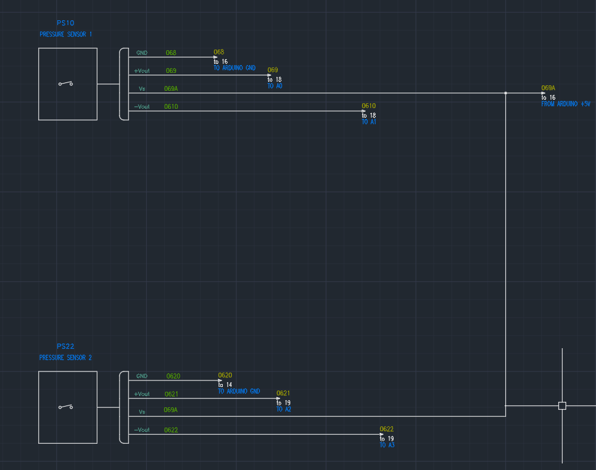

# Detailed Design for Pneumatic Road Pressure Tube Subsystem within the Secondary Data Acquisition System

# **Function of the Subsystem**

This secondary data collecting system will count the number of cars departing or entering sectors (1, 2, 4, and 6) of the Bell Hall parking lot. The counting up or down will be accomplished using a differential pressure sensor. The direction that the vehicle is moving will be the determining factor in whether the counter climbs or drops. Direct direction detection will be accomplished by placing two rows of road tubes instead of one. When a car passes over the differential pressure sensor, a signal from the sensor is transmitted to the CPU. The processor will keep track of every vehicle that enters or exits the parking lot and sends wireless data to the server.

**Constraints**

1. Placement of the road tubes

* Figure 1 shows the parking lot sectors and the entry/exit locations to the parking lot.

 Figure 1. Instance_pic
 

        		Figure 1. Parking Lot Sectors and Tube locations/lengths

*  The spots where the tubes are placed must be flat to prevent bouncing whenever a vehicle runs over them. Jumping could possibly cause double counting.
*  Placement of tubes in a spot where both wheels of the car come in contact at the same time. This is preferred because it reduces the probability of double counting.
* Attachment to post or tree
    * .The controller case should be placed above ground to prevent damage from pedestrians or water damage due to flooding.
    *  The casing must protect the processor, sensor, and other internal devices from vandalism or weather.
    * The casing will thus need to be IP67 grade.

2. Mounting/Tying down

* The mounting of the controller case will be done by tying the case to a pre-planted object, i.e... a tree or a pole.
* Tying material must be durable and resistant to vandalism.

3. Maintainability\Durability

* The controller case and road tube will require minimal maintenance once installed. There will need to be a fault message of some sort to signify when the processor is no longer counting up/down. 
* The durability of the system is contingent on the road tube that is selected. The road tube must be flexible enough, so it doesn't break whenever a vehicle runs over it. Yet it must also be tough enough to withstand cold/hot climates and UV rays.

**Buildable Schematic**

 Figure 1. Instance_one_three
 

 Figure 1. Instance_two
 

 Figure 1. 12_Volts
 

 Figure 1. Arduino_Uno_Autocad
 

 Figure 1. Wireless_Com_Board
 

 Figure 1. Dif_Pressure_Sensor
 

 Figure 1. Pressure_Sensor
 

1. Selected Sensor
    * MPX53DP Differential pressure sensor
* -   Pressure Range
    * The MX53DP has three pressure specs that are vital to its operation and durability and thus needed to be considered for selecting my pressure sensor. First, burst pressure (P1 >P2) is 200 kPa or 29 PSI; this means that exceeding this pressure would damage the sensor to the point of interoperability. Secondly, max pressure of 175 kPa or 25.4 PSI means the max pressure the sensor can accurately read. Lastly, is the pressure range spec, which is 0 – 50 kPa or 0 – 7.25 PSI. This is the pressure to output voltage range for the sensor.
* -   Finding the pressure specs in my system
    * According to Boyle’s Law, the pressure inside a sealed container is dependent on the volume inside the container. I used Boyle’s law and the Ideal Gas Law to deduce the pressure range, my thought process was to find the initial pressure inside the tube if no vehicle was over it. Since air is a gas, I used the Ideal Gas Law to find the initial pressure and the volume of a cylinder formula. My results are shown in the table below. In the table below, I used the average Cookeville weather data I found at [cite(weather-spark)], which is 88 degrees Fahrenheit for the high and 28 degrees Fahrenheit for the low. Instances 1 and 3 have the same tube length thus, the pressure will be the same at all the different “run-over points''. Instance 2 will differ since the tube length will be longer. The “length” tab displays the length in reference to the control box. Ex) Column 4/Row A has a length of 35 ft; this implies that the “run-over” spot will be 35 ft away from the control box. At 88 degrees Fahrenheit, the PSI range in instance 1&2 is 1.5 to 11.3 PSI. The instance 2 range will be 1.4 to 4.58 PSI. At 28 degrees Fahrenheit the PSI range in instance 1&3 is 0.8 to 6.16 PSI. The instance 2 range will be 0.81 to 2.58 PSI. All of these ranges are in the operating range and are less than 40 percent of my rated max pressure, so temperature deviations won't cause the PSI to exceed the max pressure. 
    * All the pressure calculations are found below in Fig 2.

 Figure 1. Pressure_Pic
 

 			  Fig 2. Pressure calculation table

2. Processor

The processor chosen for this system is the Arduino Uno Rev3[1]. This board has six analog input ports which are necessary for this system. Each system will require four analog pins, two for each of the pressure sensors.

3.  Wireless Data Transfer Module

The communication module selected for this system is the ESP8288 Wi-Fi module[2]. This module is part of the communications subsystem, but it will permit communication to the server. The module will receive the counter tally from the Arduino board and send it to the server. This device was chosen for its compatibility with the Arduino board.

4. Outdoor Case & Hardware

The case chosen is QL-201510AG[3], for the hardware will require weatherproofing to prohibit water from entering the case and damaging the hardware. All tube connections will be done at the case using the B07ZRHPRP7[4] waterproof IP68-rated nylon cable gland. The rubber tubing selected as the road tube will be RT-SYN[5]; this tubing is a synthetic blend that is specifically used in road tube applications for its resistance to UV rays and durability. The tube will be anchored down using a ground stake, VORG9089194[6]. The tube will go inside the anchor hole and be driven into the ground. A hose clamp, 2208004[7], will be placed on the end of the tube to prohibit it from slipping out off the anchor. The tube will have an end plug, 1002119[8], to keep internal pressure and not allow contaminants to enter the tube and, thus, the case.

5. Power

The power supplied to the system will be part of a separate subsystem, and it will be 12 volts. 12 volts is necessary to power the Arduino board.

6. Mounting

Mounting will be done by wrapping chain around the case and securing it the post. The chain, 47698[9], will be made of low carbon steel with a 1250 lb load, which is strong enough to prevent easy removal. The chain will be tied together using a quick link, 69062[10].
7. BOM

## Bill of Materials

| Name of Item | Description | Used in which subsystem(s) | Part Number | Manufacturer | Quantity | Unit Price | Total |
| ------------ | ----------- | -------------------------- | ----------- | ------------ | -------- | ---------- | ----- |
| Arduino Uno REV3 | Microprocessor, 14 digital I/O pins, 6 analog inputs | Secondary Acquisition System | A000066 | Arduino | 3 | $27.60 | $82.80 |
| Differential Pressure Sensor | Pressure Sensor 7.25PSI (50kPa) Differential Male - 0.19" (4.93mm) Tube, Dual 0 mV ~ 60 mV (3V) 4-SIP Module | Secondary Acquisition System | MPX53DP-ND | NXP USA Inc. | 6 | $18.92 | $113.52 |
| Road Tube | 1/4 x 9/16 OD Round-Synthetic 100' | Secondary Acquisition System | RT-SYN | Diamond Traffic Products | 3 | $117.00 | $351.00 |
| Ground Stake | 11 inch long, ⅝ diameter hole | Secondary Acquisition System | VORG9089194 | Lehigh | 6 | $2.22 | $13.32 |
| Road Tube End Plug | Allen head plug for road tube | Secondary Acquisition System | 1002119 | Lancer | 6 | $0.76 | $4.56 |
| Hose Clamp  | Steel hose clamp, ¼” - ⅝” size range | Secondary Acquisition System | 2208004 | Qilipsu | 10 | $0.63 | $6.30 |
| Cable Gland | Weatherproof IP68 adjustable locknut for 13-18 mm cable diameter | Secondary Acquisition System | B07ZRHPRP7 | Qilipsu | 6 | $10.99 | $60.99 |
| Junction box | IP67 waterproof enclosure, (7.9"x5.9"x3.9")
| Secondary Acquisition System | QL-201510AG | Qilipsu | 3 | $18.99 | $59.97 |
| Quick link | 3/16” steel quick link for chain connecting | Secondary Acquisition System | 69062 | Haul-master | 1 | $1.99 | $1.99 |
| Chain  | ¼”, 35ft chain coil | Secondary Acquisition System | 47698 | Haul-master | 1 | $35.00 | $35.00 |
| U-post | Steel post, 3ft tall | Secondary Acquisition System | 493051 | Blue hawk | 3 | $4.70 | $14.10 |
| ESP8266 | 4MB flash, wifi module | Secondary Acquisition System | WRL-17146 | Spark Fun | 3 | $7.50 | $22.50 |
|Total|	|   |   |    Total Components|    51|   Total Cost|    $711.46|

Cited Sources

1. “Arduino Uno REV3.” _Arduino Online Shop_, https://store-usa.arduino.cc/products/arduino-uno-rev3.
2. #1758620, Member. “WIFI Module - ESP8266 (4MB Flash).” _WRL-17146 - SparkFun Electronics_, https://www.sparkfun.com/products/17146.
3. _Qilipsu Junction Box with Mounting Plate 110X80X70MM, ABS ... - Amazon.com_. https://www.amazon.com/QILIPSU-Electrical-Waterproof-Dustproof-Enclosure/dp/B08PP6VYCF.
4. _QILIPSU 3/4 NPT Nylon Cable Gland, Waterproof IP68 Adjustable Locknut ..._ https://www.amazon.com/QILIPSU-Waterproof-Adjustable-Locknut-Diameter/dp/B07ZRHPRP7. 
5. “EPDM Synthetic Road Tube.” _EPDM Synthetic Road Tube | Diamond Traffic ProductsRT-SYN_, https://diamondtraffic.com/product/EPDM-Road-Tube.
6. “Lehigh GS11 Ground Stake, 11 in L, 5/8 in W, Plastic.” _Shell Lumber and Hardware_, https://www.shelllumber.com/lehigh-group-gs11-stake-ground-orange-11in.html.
7. _1/4"- 5/8" #4 Stainless Steel Hose CLAMP W/ Carbon Screw - Supplyhouse.com_. https://www.supplyhouse.com/Wal-rich-2208004-1-4-5-8-4-Stainless-Steel-Hose-Clamp-w-Carbon-Screw.
8. “Lancer 1002119 Plug 1/4 Barb S/s.” WebstaurantStore, https://www.webstaurantstore.com/lancer-1002119-plug-1-4-barb-s-s/HP1002119.html?utm_source=google&utm_medium=cpc&utm_campaign=GoogleShopping&gclid=CjwKCAiAuOieBhAIEiwAgjCvch8Q8YUq5EpRvS4erln_OCZX2wnxmZ8C3z1fgTkrXZTFjDiiX_kO2RoC3IQQAvD_BwE. 
9. “1/4 In. x 35 Ft. Chain Coil.” _Harbor Freight Tools_, https://www.harborfreight.com/1-4-quarter-inch-x-35-ft-chain-coil-47698.html.
10. “3/16 In. Quick Links, 3 Piece.” _Harbor Freight Tools_, https://www.harborfreight.com/316-in-quick-links-3-piece-69062.html. 
