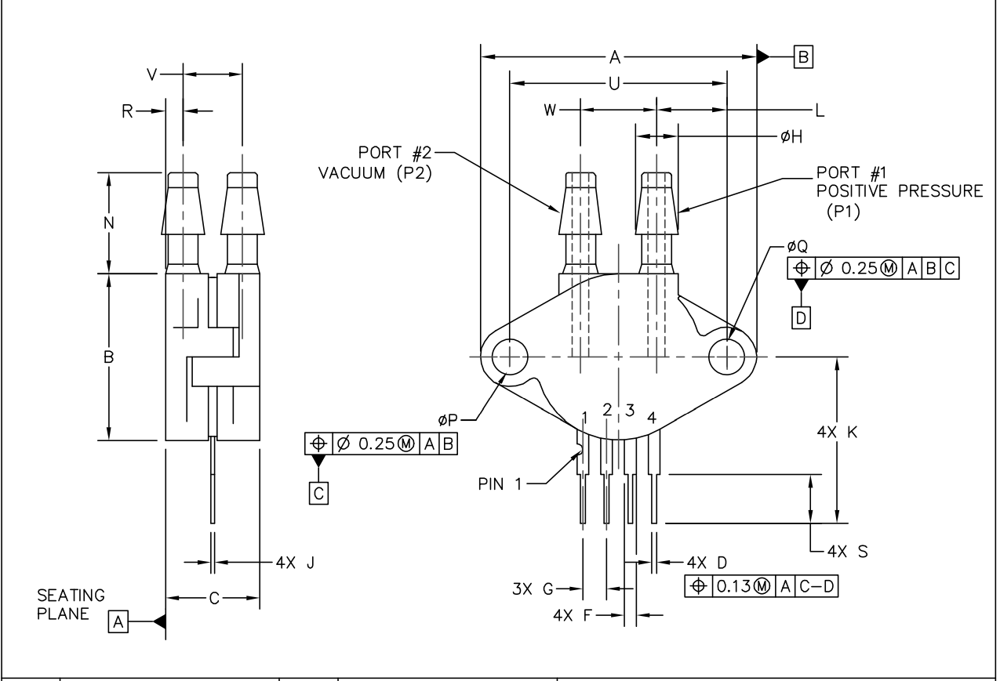

# Detailed Design for Pneumatic Road Pressure Tube Subsystem within the Secondary Data Acquisition System

# **Function of the Subsystem**

This secondary data collecting system will count the number of cars departing or entering sectors (1, 2, 4, and 6) of the Bell Hall parking lot. The counting up or down will be accomplished using a differential pressure sensor. The direction that the vehicle is moving will be the determining factor in whether the counter climbs or drops. Direct direction detection will be accomplished by placing two rows of road tubes instead of one. When a car passes over the differential pressure sensor, a signal from the sensor is transmitted to the CPU. The processor will keep track of every vehicle that enters or exits the parking lot and sends wireless data to the server.

**Constraints**

1. Placement of the road tubes

* Figure 1 shows the parking lot sectors and the entry/exit locations to the parking lot.

 Figure 1. Instance_pic
 

        		Figure 1. Parking Lot Sectors and Tube locations/lengths

* The tube placement locations must be on a flat surface and on a straight path.
    * A flat surface is necessary to prevent flapping when a vehicle runs over the road tube, RT-SYN[5],. Flapping could cause the tube to slap down on the pavement and double-count after a vehicle runs over it.
    * A straight path is necessary, so both wheels come in contact with the tube at the same time. Failing to do so could cause double counting due to the tire-to-tube contact point would occur in two separate instances.
2. Vehicle Detection/Direction
* Vehicle detection and direction are critical for the system to operate correctly. Direction is critical to know when the counter must increment or decrement.
3. Mounting/Tying Down Constraints
* Controller case, QL-201510AG[3], must be placed above ground level to prevent flood damage.
* Secure attachment to the mounting surface is necessary to prevent vandalism/theft of the controller case.
    * Worst case for vandalism would be the destruction of the case and its internal components. This could be due to a vehicle running over the case.
* The tube end must be tied down to prevent the tube from moving and remaining in its desired counting location.
4. Maintainability Constraints
* Water protection is necessary to prevent damage to the electrical components inside the system. This involves the casing and any connector that is attached to the case.
* The road tube must be flexible enough, so it doesn’t break whenever a vehicle runs over it.
*  It must also be tough enough to withstand cold/hot climates and UV rays.
    * Coldest temperature recorded in Cookeville, TN : -22 degrees Fahrenheit.
    * Hottest temperature recorded in Cookeville, TN : 105 degrees Fahrenheit.
5. Sensor Constraints
* MPX53DP[8]
    * Burst Pressure - 200kPa or 29 psi
    * Max Pressure - 175kPa or 25.4 psi
    * Pressure Range - (0 - 50kPa) or (0 - 7.25psi)
6.  Processor Constraints
* Arduino Uno Rev3[1]
    * Minimum of 4 Analog input pins
7. Data Transfer Constraints
* ESP8288 Wi-Fi module[2]
    * Wireless transfer of parking lot counter count data to the server.
8. Power Constraints
* 12V DC  is needed to operate the Arduino Board.

**Buildable Schematic**

 Figure 1. Instance_one_three
 

 Figure 1. Instance_two
 

 Figure 1. Control_System
 

 Figure 1. Pressure_Sensor
 

 **Analysis**

1. Meeting Placement Constraints
    * The road tube will only be put on flat paved areas to fulfill the placement requirements. The placement position will be visually checked to ensure there are no potholes or bumps. Tubes will be situated away from intersections. This allows both wheels to make contact with the tube at the same time, avoiding double counting.
2. Meeting Vehicle Detection/Direction Constraints
    * To fulfill vehicle detection, just one road tube must be laid across the road. However, for direction identification, two tubes must be laid parallel to each other and at least 2-2.5 feet apart. The average automobile tire is 22 inches tall, or somewhat less than 2 feet. This spacing range allows a vehicle to roll over the tubes without colliding with both of them at the same time. The direction will be determined by which tube first delivers a signal from the differential pressure sensor to the CPU.
3. Meeting Mounting/Tying Down Constraints
    * A 3ft tall  2x2 wooden post will be driven into the ground, and the controller case will mount onto it. It’s important to note that the wooden post will be part of the power system design. The case will be mounted one foot above ground level to prevent flood damage. Fasteners will be drilled into the casing/wooden post to attach it. This method is much cheaper than my chain/link method and will have a strong enough hold strength to withstand rough weather conditions.
    * Tying down the end of the tube will be done using a plastic anchor, VORG9089194[6], /hose clamp, 2208004[7], combination. The anchor has a hole where the hose can slip through, and the hose clamp will be secured to the other end. This is a cheap method to tie down the tube. Other professional options include road tape, but this option is too expensive. It has the possibility of the adhesive becoming weak and coming off.
4. Meeting Maintainability Constraints
    * IP67 case, and cable glands, B07ZRHPRP7[4],  will ensure water protection to the system. This is a valid choice due to the price not being excessive.
    * The rubber tubing used is a synthetic blend that is especially utilized in road tube applications because of its flexibility, severe temperature endurance, and UV ray resistance. The tube has a durometer rating of 60. This implies it has the same hardness as a rubber band. This will prevent the tube from cracking when a vehicle runs over it because it is too fragile. The tube has been tested at temperatures ranging from -40 to 212 degrees Fahrenheit. This range is more than adequate for Cookeville's coldest and hottest recorded temperatures. According to NRC.gov, EPDM material is certified A or good up to 100 degrees Fahrenheit, which is an outstanding grade since UV ray exposure will be constant. This tube is not a cheap alternative, but it is required owing to the everyday damage that the tube will get, since lesser solutions may have a shorter lifespan.
5. Meeting Sensor Constraints
    * Pressure Range
        * o   The MX53DP has three pressure specs that are vital to its operation and durability and thus needed to be considered for selecting my pressure sensor. First, burst pressure (P1 >P2) is 200 kPa or 29 PSI; this means that exceeding this pressure would damage the sensor to the point of interoperability. Secondly, max pressure of 175 kPa or 25.4 PSI means the max pressure the sensor can accurately read. Lastly, is the pressure range spec, which is 0 – 50 kPa or 0 – 7.25 PSI. This is the pressure to output voltage range for the sensor.
    * Finding Pressure Specs In my System
        * o   According to Boyle’s Law, the pressure inside a sealed container is dependent on the volume inside the container. I used Boyle’s law and the Ideal Gas Law to deduce the pressure range, my thought process was to find the initial pressure inside the tube if no vehicle was over it. Since air is a gas, I used the Ideal Gas Law to find the initial pressure and the volume of a cylinder formula. My results are shown in the table below. In the table below, I used the average Cookeville weather data I found at [cite(weather-spark)], which is 88 degrees Fahrenheit for the high and 28 degrees Fahrenheit for the low. Instances 1 and 3 have the same tube length thus, the pressure will be the same at all the different “run-over points''. Instance 2 will differ since the tube length will be longer. The “length” tab displays the length in reference to the control box. Ex) Column 4/Row A has a length of 35 ft; this implies that the “run-over” spot will be 35 ft away from the control box. At 88 degrees Fahrenheit, the PSI range in instance 1&2 is 1.5 to 11.3 PSI. The instance 2 range will be 1.4 to 4.58 PSI. At 28 degrees Fahrenheit, the PSI range in instance 1&3 is 0.8 to 6.16 PSI. The instance 2 range will be 0.81 to 2.58 PSI. All of these ranges are in the operating range and are less than 40 percent of my rated max pressure, so temperature deviations won't cause the PSI to exceed the max pressure. 

 Figure 1. Pressure_Pic
 

 			  Fig 2. Pressure calculation table

6. Meeting Processor Constraints
* The Arduino Uno Rev3[1] CPU was selected for this system. This board includes six analog input pins, which is two more than is required for this system and hence meets the limitation. Two analog pins will be required for each pressure sensor in each system.
7.  Meeting Data Transfer Constraints
* The ESP8288 Wi-Fi module[2] was chosen as the connectivity module for this system. This module is part of the communications subsystem, however, it will allow wireless connectivity to the server through wi-fi. The counter tally will be received by the module from the Arduino board and wirelessly sent to the server.
8. Meeting Power Constraints
* The power supplied to the system will be part of a separate subsystem, and it will be the necessary 12V DC to power the board.
9. Potential Issues
* The post/mounting is not the most secure method. However, it is a cheap method that should prove sufficient for a proof of concept. Any vandalism or damage caused to the system will be considered an acceptable risk. 
* Even though the tubes selected are specifically used for pneumatic road tube applications, they are not indestructible. Due to the daily abuse, they will be receiving, they are susceptible to being damaged. This could potentially be an expensive maintenance issue but will be considered an acceptable risk. 
7. BOM

## Bill of Materials

| Name of Item | Description | Used in which subsystem(s) | Part Number | Manufacturer | Quantity | Unit Price | Total |
| ------------ | ----------- | -------------------------- | ----------- | ------------ | -------- | ---------- | ----- |
| Arduino Uno REV3 | Microprocessor, 14 digital I/O pins, 6 analog inputs | Secondary Acquisition System | A000066 | Arduino | 3 | $27.60 | $82.80 |
| Differential Pressure Sensor | Pressure Sensor 7.25PSI (50kPa) Differential Male - 0.19" (4.93mm) Tube, Dual 0 mV ~ 60 mV (3V) 4-SIP Module | Secondary Acquisition System | MPX53DP-ND | NXP USA Inc. | 6 | $18.92 | $113.52 |
| Road Tube | 1/4 x 9/16 OD Round-Synthetic 100' | Secondary Acquisition System | RT-SYN | Diamond Traffic Products | 3 | $117.00 | $351.00 |
| Ground Stake | 11 inch long, ⅝ diameter hole | Secondary Acquisition System | VORG9089194 | Lehigh | 6 | $2.22 | $13.32 |
| Road Tube End Plug | Allen head plug for road tube | Secondary Acquisition System | 1002119 | Lancer | 6 | $0.76 | $4.56 |
| Hose Clamp  | Steel hose clamp, ¼” - ⅝” size range | Secondary Acquisition System | 2208004 | Qilipsu | 10 | $0.63 | $6.30 |
| Cable Gland | Weatherproof IP68 adjustable locknut for 13-18 mm cable diameter | Secondary Acquisition System | B07ZRHPRP7 | Qilipsu | 6 | $10.99 | $60.99 |
| Junction box | IP67 waterproof enclosure, (7.9"x5.9"x3.9")
| Secondary Acquisition System | QL-201510AG | Qilipsu | 3 | $18.99 | $59.97 |
| Quick link | 3/16” steel quick link for chain connecting | Secondary Acquisition System | 69062 | Haul-master | 1 | $1.99 | $1.99 |
| Chain  | ¼”, 35ft chain coil | Secondary Acquisition System | 47698 | Haul-master | 1 | $35.00 | $35.00 |
| U-post | Steel post, 3ft tall | Secondary Acquisition System | 493051 | Blue hawk | 3 | $4.70 | $14.10 |
| ESP8266 | 4MB flash, wifi module | Secondary Acquisition System | WRL-17146 | Spark Fun | 3 | $7.50 | $22.50 |
|Total|	|   |   |    Total Components|    51|   Total Cost|    $711.46|

Cited Sources

1. “Arduino Uno REV3.” _Arduino Online Shop_, https://store-usa.arduino.cc/products/arduino-uno-rev3.
2. #1758620, Member. “WIFI Module - ESP8266 (4MB Flash).” _WRL-17146 - SparkFun Electronics_, https://www.sparkfun.com/products/17146.
3. _Qilipsu Junction Box with Mounting Plate 110X80X70MM, ABS ... - Amazon.com_. https://www.amazon.com/QILIPSU-Electrical-Waterproof-Dustproof-Enclosure/dp/B08PP6VYCF.
4. _QILIPSU 3/4 NPT Nylon Cable Gland, Waterproof IP68 Adjustable Locknut ..._ https://www.amazon.com/QILIPSU-Waterproof-Adjustable-Locknut-Diameter/dp/B07ZRHPRP7. 
5. “EPDM Synthetic Road Tube.” _EPDM Synthetic Road Tube | Diamond Traffic ProductsRT-SYN_, https://diamondtraffic.com/product/EPDM-Road-Tube.
6. “Lehigh GS11 Ground Stake, 11 in L, 5/8 in W, Plastic.” _Shell Lumber and Hardware_, https://www.shelllumber.com/lehigh-group-gs11-stake-ground-orange-11in.html.
7. _1/4"- 5/8" #4 Stainless Steel Hose CLAMP W/ Carbon Screw - Supplyhouse.com_. https://www.supplyhouse.com/Wal-rich-2208004-1-4-5-8-4-Stainless-Steel-Hose-Clamp-w-Carbon-Screw.
8. “MPX53DP: Digi-Key Electronics.” _Digi_, https://www.digikey.com/en/products/detail/nxp-usa-inc/mpx53dp/951812. 
9. _Chemical Resistance and Chemical Applications for CPVC Pipe and Fittings._ https://www.nrc.gov/docs/ML1820/ML18207A604.pdf. 
