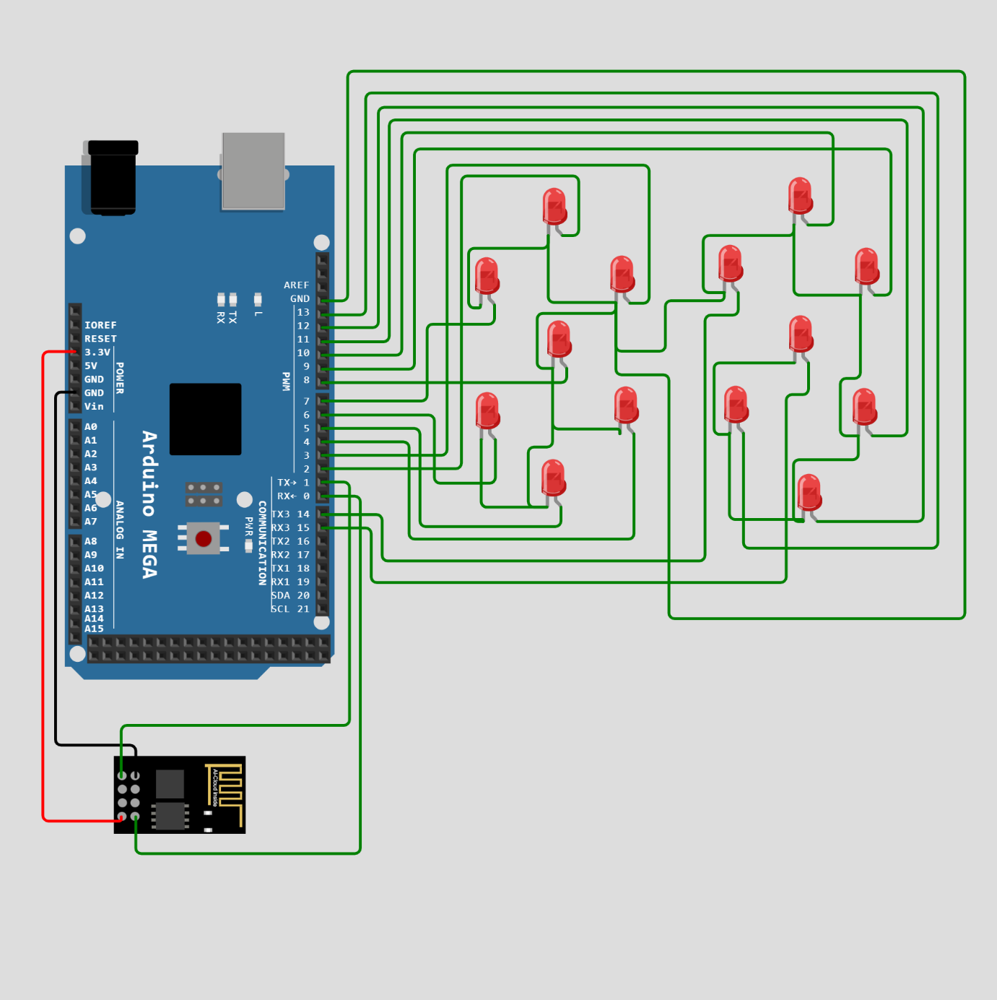

# Sign System Detail Design

## Big Picture

The sign that will be implemented into this project will show the current number of available parking spots for the monitored lot.This will be updated roughly as often as the mobile application. The data being sent to the display will be from the primary and secondary data acquisition systems. That data will then be sent to the server and programmed into readable data to the sign. The sign will then consist of a text message stating “Open Spots Available”.Then, there will be two large weatherproof seven segment displays stating how many available spots there are. This will then be controlled by an Arduino that is wirelessly receiving data from the server.This whole system will then need to be waterproofed and mounted to a standing sign.

## Specifications

1. Seven-Segment Display & Controls
  *At least 1 foot in height and 6 inches in width (LED display)
  *Microprocessor to control each LED and receive data

2. Wireless Data Transfer Module to receive information

3. Outdoor Physical Sign/Stand
  *Text above Seven-Segment Display Stating “Open Spots Available”

4. 12 V DC Power for LEDs and Arduino

## Analysis
	
  *Seven-Segment Display and Controls

The Seven-Segment (SS) display needs to be large enough to be seen from the entrance into the parking lot. After lots of research, not many options are available for large seven segment displays, so the idea of creating a custom made large waterproof seven segment display came to light. This will consist of seven red 12 V LED light strips [2] per display, so 14 of them total. The chosen LED strips can be cut to the desired length for whatever application, which will roughly be 6 inches per strip. This will make each segment roughly 7 inches (W) x 13 inches (H). These will be configured and controlled much like typical SS displays minus the decimal point due to that not being necessary for this application. Each LED will then be controlled either being on or off by an Arduino Mega 2560 REV3 [A000067] [1]. This specific Arduino board has 54 digital I/O ports which is necessary for this application. Previously, an Arduino Uno board was chosen for this, but the wireless module must use the serial pins (TXD and RXD) for communication on the board. These pins share the same ports as two of the digital I/O ports. This would leave only 12 I/O pins available, while 14 are needed. Each output only sends a 5 V signal with 40 mA of current. This is not enough voltage or current for the LEDs, therefore a power transistor circuit will be used for each LED consisting of a IRLZ44N [6] power transistor, a 12V DC source, a 10 KOhm resistor, and necessary grounding. Each LED strip will then be connected to each Arduino Uno digital I/O pin. The necessary programming will then be in place to control each pin on the Arduino board.

]

 Figure 1. Arduino Circuit Diagram
 

  *Wireless Data Transfer Module

The chosen wireless data transfer module will be a part of the communications subsystem, but the device that will allow for this capability will be the ESP8288 WiFi module [7]. This device specifically works with the Arduino IDE very well. 

  *Physical Sign Stand	

The physical sign stand will be an A-Frame sandwich style sign that expands and has room to put each SS display. As stated above, each segment will roughly be 7 inches x 13 inches which will fit in the sign (24 inches x 36 inches). Each display will be evenly spaced with roughly a 2 inch gap in between displays. The chosen sign also has holes to fill with sand for added weight and stability[4]. A custom waterproof vinyl poster will also be attached to this sign displaying the text “Open Spots Available”. 

]

 Figure 2. Physical Sign Schematic with LED Strip Formation
 

	*Power 

The power that will be sent to the sign will be a separate subsystem sending out 12 Volts. This will be sent to each LED strip on the sign and to the Arduino. 

]

 Figure 3. Arduio to LED Strip power circuit
 

## BOM for Sign

| Name of Item | Description | Used in which subsystem(s) | Part Number | Manufacturer | Quantity |    Price   | Total |
| ------------ | ----------- | -------------------------- | ----------- | ------------ | -------- | ---------- | ----- |
|Arduino Mega 2560 REV3 [A000067]|     "Microprocessor, 54 digital I/O pins, 16 analog inputs "|     Sign|     2560 R3|     Arduino|     1|     $48.40|     $48.40|
|Keiurot Car Led Strip Lights|     "2CM Waterproof Led Light Strips for Cars Motorcycles Golf Cart Interior & Exterior Marine Boat Red Led Strip 12V 5050 18SMD|      Pack of 4"|     Sign|     4P-MDLEST0011-R|     Keiurot|     4|     $12.69|     $50.76|
|Jumbl Outdoor A-Frame Sandwich Signboard 24” x 36” Display Surface|     PVC Sign Protector & Sand Fill Holes – Duel Display Signage Stand for Storefront Sidewalk Curb (Black)|     Sign|     JUMCHH583B|     Jumbl|     1|     $129.99|     $129.99|
|Sakrete 0.5-cu ft 50-lb All-purpose Sand|     All Purpose Sand|     Sign|     40100223|     Sakrete|     1|     $5.48|     $5.48|
|wall26 Custom Poster Prints|     "Personalized Pictures Photos to Vinyl|      Durable and Waterproof 24x36 inches"|     Sign|     PPP-CUSTOM-24x36|     wall26|     1|     $22.99|     $22.99|
|IRLZ44NPBF|     "N-Channel 55 V 47A (Tc) 3.8W (Ta)|      110W (Tc) Through Hole TO-220AB"|     Sign|     IRLZ44NPBF|     Infineon Technologies|     14|     $1.52|     $21.28|
|WiFi Module - ESP8266 (4MB Flash)|      Self contained SOC with integrated TCP/IP protocol stack that can give any microcontroller access to your WiFi network|     Sign|     WRL-17146|     Sparkfun|     1|     $7.50|     $7.50|
|Total|     |     |     |     Total Components|     23|     Total Cost|     $286.48|

Cited Sources
 [1] “Arduino Mega 2560 REV3 [A000067],”amazon.com, 2022.
Amazon.com: Arduino Mega 2560 REV3 [A000067] : Electronics

[2] “Car Led Strip Lights 32CM Waterproof Led Light Strips for Cars Motorcycles Golf Cart Interior & Exterior Marine Boat Red Led Strip 12V 5050 18SMD,Pack of 4,” amazon.com, 2022.
Amazon.com: Car Led Strip Lights 32CM Waterproof Led Light Strips for Cars Motorcycles Golf Cart Interior & Exterior Marine Boat Red Led Strip 12V 5050 18SMD,Pack of 4 : Everything Else

[3] “Jumbl Outdoor A-Frame Sandwich Signboard 24” x 36” Display Surface – w/PVC Sign Protector & Sand Fill Holes – Duel Display Signage Stand for Storefront Sidewalk Curb (Black),” amazon.com, 2022.
Amazon.com : Jumbl Outdoor A-Frame Sandwich Signboard 24” x 36” Display Surface – w/PVC Sign Protector & Sand Fill Holes – Duel Display Signage Stand for Storefront Sidewalk Curb (Black) : Office Products

[4] “Sakrete  0.5-cu ft 50-lb All-purpose Sand,” lowes.com, 2022.
Sakrete 0.5-cu ft 50-lb All-purpose Sand in the Sand department at Lowes.com

[5] “wall26 Custom Poster Prints, Personalized Pictures Photos to Vinyl, Durable and Waterproof 24x36 inches,” amazon.com, 2022.
Amazon.com: wall26 Custom Poster Prints, Personalized Pictures Photos to Vinyl, Durable and Waterproof 24x36 inches: Posters & Prints

[6] “IRLZ44NPBF,” digikey.com, 2022.
IRLZ44NPBF Infineon Technologies | Discrete Semiconductor Products | DigiKey

[7] “WiFi Module - ESP8266 (4MB Flash).” sparkfun.com, 2022.
WiFi Module - ESP8266 (4MB Flash) - WRL-17146 - SparkFun Electronics
