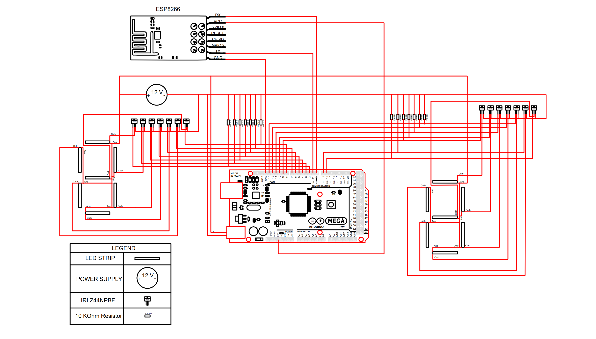

# Sign System Detail Design

## Function of the Subsystem

The sign will be a physical entity at the entrance of the parking lot that will display the current number of available parking spots in the parking lot. This will allow students to decide if they even enter the parking lot and has the potential to save the students time searching for a parking spot. This subsystem is to be used in unity with the mobile application which will also display the same information. It will acquire its data from the server/database wirelessly with the initial data being from the data acquisition subsystem(s). It will then use custom seven-segment displays, a microprocessor, and a power transistor circuit to display this information on the physical sign.

## Constraints

1. Seven-Segment Display & Controls
- Must have waterproof controllable display directly viewable in the daylight ("the minimum luminance required for a LED to be visible in direct sunlight is around 10,000 to 15,000 millicandela (mcd). However, this can vary depending on the specific application and viewing conditions. For example, a LED used in a traffic signal or sign may require a higher luminance level to ensure visibility in a busy urban environment with high levels of background light." [12]) and from the road capable of showing number of open parking spots 
- Must have a microcontroller with at least a 14 Digital output PINs, RX/TX PINs, and capable of connecting a external wireless communication module to connect to the 
- Must have a power circuit rated for switching display LEDs on/off using microcontroller output PIN voltage and power from separate subsystem

2. Outdoor Physical Sign/Stand
- Must be large enough to hold controllable display and static text viewable from the road
- Must be able to withstand reasonable weather requirements (storm, mid to heavy wind, etc.)

3. Weatherproofing
- Must protect Seven-Segment display controls from dust and water (Note: This design will be handled by the sign power subsystem)

## Buildable Schematic

 Figure 1. Arduino Circuit Diagram
 

 Figure 2. Physical Sign PDF Schematic 
 

 Figure 3. Physical Sign Final Product Schematic View
 

 Figure 4. Physical Sign 3D Schematic View
 

Note: 
- The dimensions on the final view show the placement of each LED strip/Lens. 
- Each LED strip's wires will also be sent to the weatherpoof box holding all circuit components (In the Power subsystem signoff). The necessary holes will be drilled through the sign behind each Lens/Strip for each wire to be fed through. 	

## Analysis

1. Seven-Segment Display & Controls

a. LED Strips 

- Will consist of 7 red 12 V LED light strips per display (14 total)
- Wires will be fed through the sign through drilled holes at the end of each strip
> - Each LED strip is roughly 6 inches long
> - Each segment is roughly 7 inches (W) x 13 inches (H) 
> - The following analysis shows how these seven-segments will meet the required constraints of visibility:
> > - Length of road parallel to main entrance is roughly 100 feet and width is roughly 20 feet [6]
> > - Maximum viewing distance when entering the lot is 102 feet [6]
> > - Optimum viewing distance is 120 feet and maximum viewing distance is 525 feet [5]

- Keiurot LED strips chosen for:
> - Already waterproof (IP67 rated)
> - LED strips rated for 1000 Lumens each (18 LEDs total per strip so 55.5 Lumens per LED) , a max viewing apex angle of 160 degrees (average max for LED strips) equates to roughly 10,680 millicandela. which meets the constraint of at least 10,000 millicandela total for daylight visibility. 
> - 3M adhesive weather-resistant backing to attach directly to the lens covers.
> - Cuttable to size of 6 inches per strip to meet the size constraint of creating a viewable display from the road (7 inch x 13 inch seven-segment displays)
The specs/features above show that the product meets the required constraints.

- Muzata Milky White LED Cover Lens was chosen for:
> - A lens to cover the Keiurot LED strips to meet the constraint of visibility due to the necessity of not staring directly at the LEDs. 
> - This lens cover also meets all size constraints of the Keiurot LED strips.
> - This lens cover also comes with mounting hardware and end caps for a clean finish and to attach to the sign.
> - Note: This cover allows the LED strips to directly be viewed by shining onto a translucent surface, and will completely house each LED strip. 

b. Microcontroller

- Arduino Mega board chosen for:
> - Necessary capabilities for number of PINs, serial communication, and output for ESP8266 module
> - 54 digital I/O ports and multiple serial communication PIN options
> - 3.3 V output for ESP8266 module and 16 PINs for outputs to power transistors and serial communication to external module
> - Arduino's IDE works well with ESP8266 module 

The specs/features above show that the product meets the required constraints.
	
c. Power Transistor Circuits

- Power transistor circuit used for each LED, consisting of IRLZ44N power transistor, 12V DC source, 10 KOhm resistor, and grounding
- Each transistor connected to an Arduino Mega digital I/O pin

- IRLZ44NPBF power transistors chosen for:
> - Rated for up to 55 V and 47 A (VDSS) which meets the required constraints of 12 V and 0.7 A per LED strip
> - VGS(th) is 1 V which meets the required constraint of 5V output from Arduino I/O PINs

Note: Each transistor will be switched on and off by the Arduino effectively opening and closing the circuit with 12 V constantly being supplied to each LED strip as seen in Figure 1.

The specs/features above show that the product meets the required constraints.

2. Wireless Data Transfer Module

- The Sparkfun ESP8266 Module was chosen for:
> - Its wireless capabilities
> - The module is very compatible with the Arduino Mega board and its IDE
- In-depth analysis can be found in the corresponding communication signoff.

The specs/features above show that the product meets the required constraints.
	
3. Outdoor Physical Sign/Stand

- The RoadTrafficSigns Custom 18” x 24” Aluminum Sign was chosen due to it meeting the size constraint of being to at least be able to hold both seven segment displays totalling 16 inches x 13 inches (each display being 7 inches x 13 inches with 2 inches of spacing).

- This sign also has customizable text options for placement and size when ordering that meets the static text constraint.

- This will then be mounted to the post shown in the power subsystem design using the add-on mounting hardware with the custom sign. 
 
4. Power 

The power that will be sent to the sign will be a separate subsystem sending out 12 Volts and the required current output for connected components. This will be sent to each LED strip on the sign and to the Arduino. 

The in depth analysis of this and the solar panel mounting to the post will be in the corresponding power signoff. 
Note: The detailed schematic and design for the post will be in the power detail design.

5. Weatherproofing

Weatherproofing will be designed in the Sign Power subsystem. 
Note: This will include the housing for all of the transistors, Arduino, communication module, and battery.

## BOM for Sign

| Name of Item | Description | Used in which subsystem(s) | Part Number | Manufacturer | Quantity |    Price   | Total |
| ------------ | ----------- | -------------------------- | ----------- | ------------ | -------- | ---------- | ----- |
|Arduino Mega 2560 REV3 [A000067]|     "Microprocessor, 54 digital I/O pins, 16 analog inputs "|     Sign|     2560 R3|     Arduino|     1|     $48.40|     $48.40|
|Keiurot Car Led Strip Lights|     "2CM Waterproof Led Light Strips for Cars Motorcycles Golf Cart Interior & Exterior Marine Boat Red Led Strip 12V 5050 18SMD Pack of 4"|     Sign|     4P-MDLEST0011-R|     Keiurot|     4|     $12.69|     $50.76|
|IRLZ44NPBF|     "N-Channel 55 V 47A (Tc) 3.8W (Ta) 110W (Tc) Through Hole TO-220AB"|     Sign|     IRLZ44NPBF|     Infineon Technologies|     14|     $1.52|     $21.28|
|WiFi Module - ESP8266 (4MB Flash)|      Self contained SOC with integrated TCP/IP protocol stack that can give any microcontroller access to your WiFi network|     Sign|     WRL-17146|     Sparkfun|     1|     $7.50|     $7.50|
|Custom 18” x 24” Aluminum Sign|      Custom Aluminum Sign with Custom Wording|     Sign|    K-3428-BK|     RoadTrafficSigns|     1|     $37.75|     $37.75|
|Post Attachment Kit|      2 Bolts for Heavy Duty Posts and 2 Bolts for Economy Posts Attachment Hardware for Posts - 4 bolts|     Sign|	K-KIT2|     RoadTrafficSigns|     1|     $1.87|     $1.87|
|Muzata Milky White LED Cover Lens|     10PACK 3.3FT/1M Flexible Silver LED Channel with Milky White LED Cover Lens|     Sign|   MZZ411|     Muzata|     2|     $39.99|     $79.98|
|Total|     |     |     |     Total Components|    24|     Total Cost|     $247.54|

## Revisions

Rev. 1 
- Added more detail to 3D schematic
- Updated Analysis and Constraints with more detail
- Switched some info in Analysis to Constraints

Rev. 2
- Clarified LED strip and vinyl poster mounting in correlation to the 3D buildable schematic.
- Removed unnecessary text from Constraints section.
- Added mounting tape to BOM.

Rev. 3
- Reorganized info completely/cut out most paragraphs and listed spec/constraints.

Rev. 4
- Added info about LED visibility in daylight.

Rev. 5
- Changed design from A-Frame sign to post with aluminum sign and clarified details about this in the analysis, BOM, and sources. 

Rev. 6
- Redefined LED light analysis
- Fix Citations
- Clarified transistor analysis and constraints

Rev. 7
- Clarified LED visibility (size and brightness)

Rev. 8
- Added Lens cover for LED strips

Rev. 9
- Changed info on LED brightness and updated 3D schematic
	
## Cited Sources
 [1] “Arduino Mega 2560 REV3 [A000067],”amazon.com, 2022.
https://www.amazon.com/ARDUINO-MEGA-2560-REV3-A000067/dp/B0046AMGW0/ref=sr_1_3?keywords=Amazon.com%3A+Arduino+Mega+2560+REV3+%5BA000067%5D+%3A+Electronics&qid=1675097507&sr=8-3

[2] “Car Led Strip Lights 32CM Waterproof Led Light Strips for Cars Motorcycles Golf Cart Interior & Exterior Marine Boat Red Led Strip 12V 5050 18SMD,Pack of 4,” amazon.com, 2022. https://www.amazon.com/Lights-Waterproof-Motorcycles-Interior-Exterior/dp/B09NBFTN34?th=1

[3] “IRLZ44NPBF,” digikey.com, 2022.
https://www.digikey.com/en/products/detail/infineon-technologies/IRLZ44NPBF/811808

[4] “WiFi Module - ESP8266 (4MB Flash).” sparkfun.com, 2022.
https://www.sparkfun.com/products/17146

[5] “Sign Letter Height Visibility Chart.” Signazon.com, 2022. https://www.signazon.com/help-center/sign-letter-height-visibility-chart.aspx

[6] “Detailed Design for Camera Subsystem within Primary Data Acquisition System”. Github.com, 2022. https://github.com/kesternucum/ECE-Capstone-Team3/blob/main/Documentation/Signoffs/detaildesign_camera.md

[7] "Flemoon Large Outdoor Electrical Box (12.5 x 8.5 x 5 inch), IP54 Waterproof Outdoor Extension Cord Cover Weatherproof, Protect Outlet, Plug, Socket, Timer, Power Strip, Holiday Light Decoration, Black." Amazon.com, 2022. https://www.amazon.com/Flemoon-Electrical-Waterproof-Weatherproof-Decoration/dp/B09NLW5HMX/ref=sr_1_6?crid=1LA2KM2X4G1R0&keywords=waterproof%2Bjunction%2Bbox&qid=1675091689&sprefix=waterproof%2Bjunctio%2Caps%2C480&sr=8-6&th=1

[8] “Nits vs Lumens vs Luminance.” New Haven Display, 2022. https://newhavendisplay.com/blog/nits-vs-lumens-vs-luminance/#:~:text=1%20Nit%20%3D%203.426%20Lumens.%20To%20convert%20nits,by%203.426.%20How%20to%20convert%20lumens%20to%20nits%3F

[9] “18" x 24" Customizable Horizontal Black Sign Template.” RoadTrafficSigns, 2022.
https://www.roadtrafficsigns.com/fos/custom-metal-sign/custom-metal-sign-18x24/sku-k-3428-bk

[10] “Muzata 10PACK 3.3FT/1M Flexible Silver LED Channel with Milky White LED Cover Lens Bendable Aluminum Profile Housing Track for Strip Tape Light Anodized Curved Mount U106 1M WW, LB1.” amazon.com, 2022.
https://www.amazon.com/dp/B07P8NWBP5/ref=emc_b_5_t

[11] “Candela.” Nist, 2022.
https://www.nist.gov/si-redefinition/candela

[12] Illuminating Engineering Society (IES) Lighting Handbook, 10th Edition, Chapter 27: Daylighting Metrics, Section 27.2.2 "Luminance Contrast Ratio", and Section 27.3.3 "Minimum Luminance".
