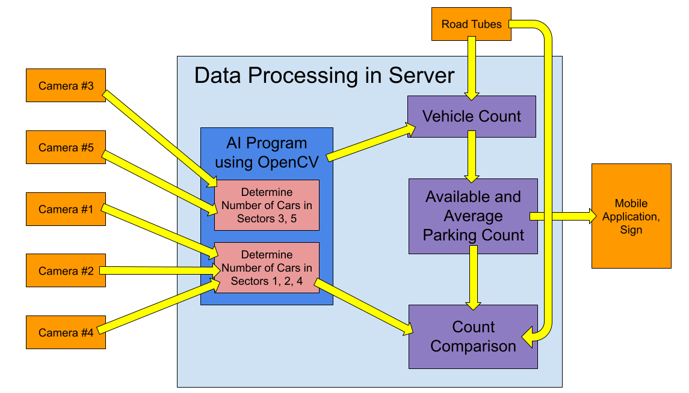

# Detailed Design for Artificial Intelligence Software Subsystem in Server

## Big Picture

Cameras will be used to track 53 of the 78 spots in the parking lot behind
Bell Hall (due to certain areas of the lot being hard to mount a camera system
to view–see Detailed Design for Camera Subsystem within Primary Data
Acquisition System for reasoning). The live video feed from these cameras
will be transmitted wirelessly via Wi-Fi to a remote server in which an
artificial intelligence (AI) program will process the video feeds to determine
the number of available parking spots out of the 53 that are being tracked by
cameras. This number will then be added to the number of available parking spots
in the 25 spots only tracked by the road tubes in the secondary data acquisition
system. This subsystem, which is purely software, is dependent upon the primary
data acquisition system which uses cameras, and both the mobile application and
signage are dependent upon the output from the AI program.

## Specifications

We plan to use the OpenCV library, an free and open-source library for real-time
computer vision that is considered the de facto standard tool for image
processing [1]. OpenCV can be interfaced with Python, which is what we plan to
use due to the language’s availability of libraries, simplicity, and robustness
for artificial intelligence and machine learning applications. In addition,
OpenCV can be implemented in Linux, the operating system that we plan to use on
our server. OpenCV also has over 2,500 algorithms, extensive documentation, and
an active community which will equip us to learn how to use OpenCV in our system
[2]. The free cost and the open-source license allows us to be able to utilize
this library without having to pay any royalties, licensing fees, or costs to
use the application.

The AI program we use must be able to be trained and tested to recognize
motorized vehicles (since the most straight-forward solution to count the number
of available parking spots is to count the number of cars and subtract that
number from an a priori total of parking spots). In addition, the AI program
must also be able to be interfaced with multiple cameras since we will be using
five cameras. The AI algorithm must also be able to identify cars at a
resolution of 10 pixels per foot, which was determined as the minimum resolution
for the cameras to see a car (see Detailed Design for Camera Subsystem within
Primary Data Acquisition System), as well as identify partial cars, particularly
in the worst-case in which one car is partially obstructed by another car at a
very far distance.

Figure 1 shows how the inputs from the cameras feed into the AI program, which
are to be processed into vehicle counts that are error-checked and sent to the
user interface outputs which are the mobile application and sign.

## Buildable PDF Schematic

]

## Analysis

Vehicle Recognition
* OpenCV has been used to detect and count vehicles, as shown in [3] [4] [5]. Because these attempts have been successfully integrated into a larger hardware/software system that detects and counts vehicles, OpenCV provides the tools needed for our purposes of determining the number of available parking spots via tracking the number of cars in sectors of the parking lot.

Multiple Cameras
* OpenCV can be used with multiple cameras, as seen by [4]. The Python program can be written to accept inputs from distinct camera inputs, which allows us to have multiple data input streams, i.e. the cameras.

Resolution
* The study in which the minimum camera resolution of 10 pixels per foot was determined used a computer vision algorithm from OpenCV to identify 64 x 64 bit images. Thus, OpenCV can be used to identify vehicles at a minimum resolution of 10 pixels per foot, provided that the inputs we provide from the camera meet that specification.

Partial Image Recognition
* It has been seen in [7] that cars that are partially obstructed can be identified as vehicles (although the system is for measuring speed but still has to identify/detect cars). Thus, OpenCV has algorithms that are able to detect cars even if one is obstructing the other.

## Bill of Materials

| Name of Item	| Description | Used in which subsystem(s) | Part Number	| Manufacturer	| Quantity | Unit Price	| Total |
| ------------ | ----------- | -------------------------- | ----------- | ------------ | -------- | ---------- | ----- |
| OpenCV | Open source computer vision library | Server | NA | Intel, later open source | 1	| $0.00	| $0.00 |
| Python	| Programming language | Server	| NA	| NA | 1 | $0.00 |	$0.00 |
| | | | | | | | **$0.00** |

## Cited Sources

[1] G. Boesch, “The 12 Most Popular Computer Vision Tools in 2022,” _Viso Suite_, 2022. [https://viso.ai/computer-vision/the-most-popular-computer-vision-tools/](https://viso.ai/computer-vision/the-most-popular-computer-vision-tools/ )

[2] G. Boesch, “What is OpenCV? The Complete Guide (2022),” Viso Suite, 2022. [https://viso.ai/computer-vision/opencv/](https://viso.ai/computer-vision/opencv/ )

[3] A. Gulati, “Vehicle Detection and Counting System using OpenCV,” Analytics Vidhya, 31 December 2022. [https://www.analyticsvidhya.com/blog/2021/12/vehicle-detection-and-counting-system-using-opencv/](https://www.analyticsvidhya.com/blog/2021/12/vehicle-detection-and-counting-system-using-opencv/)

[4] S. Rameshkumar, K. Swathi, A. Sangeetha, N. Sophia Sindhuja, “Real-Time Vehicle Counting Using Computer Vision,” Ijariie, vol. 6, no. 5, 2020. [http://ijariie.com/AdminUploadPdf/Real_Time_Vehicle_Counting_Using_Computer_Vision_ijariie12606.pdf](http://ijariie.com/AdminUploadPdf/Real_Time_Vehicle_Counting_Using_Computer_Vision_ijariie12606.pdf)

[5] A. Gunzi, “Vehicle Detection and Tracking using Computer Vision,” _Chatbots Life_, 7 Mar 2017. [https://chatbotslife.com/vehicle-detection-and-tracking-using-computer-vision-baea4df65906](https://chatbotslife.com/vehicle-detection-and-tracking-using-computer-vision-baea4df65906)

[6] T. Amaratunga, “Using Multiple Cameras with OpenCV,” Codes of Interest,  September 2018. [https://www.codesofinterest.com/2018/09/using-multiple-cameras-with-opencv.html](https://www.codesofinterest.com/2018/09/using-multiple-cameras-with-opencv.html)

[7] H. Parmar, “Detect speed of a car with OpenCV in Python,” CodeSpeedy. [https://www.codespeedy.com/detect-speed-of-a-car-with-opencv-in-python/](https://www.codespeedy.com/detect-speed-of-a-car-with-opencv-in-python/ )
