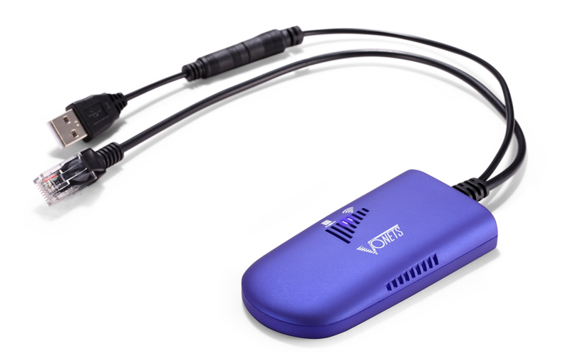
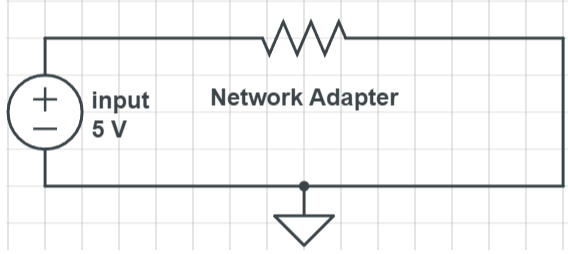

# Camera Communications Detail Design

## Big Picture

1. The camera communications subsystem will interact directly with each camera as part of its build. This subsystem will allow each individual camera to connect to the small LAN(Local Area Network) that is provided by the server and its corresponding communications subsystem. This implies a need to provide each camera with the capability of connecting to WiFi. The chosen cameras have only ethernet (RJ45) inputs and thus require an adapter to connect them to a WiFi network.

## Specifications

1. Chosen Device
    * Vonets VAP11G-300[1]
2. Network Capabilities
    * 300Mbps transmission rate
3. Security Protocols
    * WEP(64,128), WPA, WPA-PSK, WPA2, and WPA2-PSK
4. Power
    * Consumes Less than 2W
    * 5V DC
    * DC 2.0 power hole or USB power input
5. Dimensions
    * 90mm x 45mm x 15mm

## Analysis

1. The only communication cable that exits the chosen cameras is a POE(Power Over Ethernet) ethernet cable. For this project, it is considered impractical for wired communications to be used, and as such, the aforementioned device will allow for connectivity with the LAN that will be hosted by the server’s communication system.
2. Many adapters exist on the market for this interface, but the Vonets VAP11G-300 WiFi bridge was chosen for its small size, low power consumption, DC input, and the bandwidth it can handle.
3. Using an aggressive estimate to approximate the bandwidth required by the device, using 3 megapixels and 30 frames per second at the highest quality in the calculations, the camera would require only 76.8 Mbps[2], compared to the 300Mbps provided by the adapter, this is well within scope.
4. The setup of this device would be simple, consisting of connecting the ethernet cable to a POE injector that feeds into the camera’s CAT5(ethernet) port directly. To power it, the device can be fed 5V DC to its DC 2.0 power hole.

## Cited Sources

[1] “Vonets VAP11G-300,” _en.vonets.es_, 2022.

[http://en.vonets.es/products/VAP11G-300/](http://en.vonets.es/products/VAP11G-300/)

[2]”StarDot Technologies Bandwidth and Storage Calculator,” _stardom.com,_ 2022.

[http://stardot.com/bandwidth-and-storage-calculator](http://stardot.com/bandwidth-and-storage-calculator)