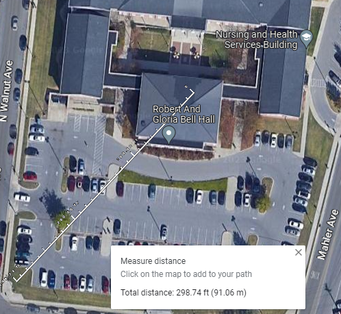
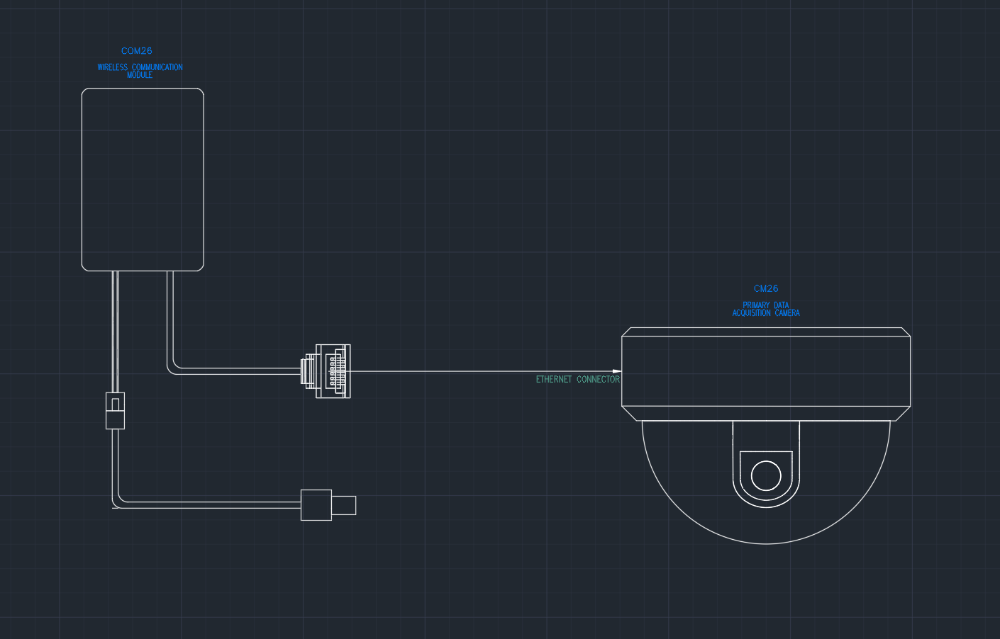

# Camera Communications Detail Design

## Function of Subsystems

The camera communications subsystem allows each camera to connect to the university's Wi-Fi network so that the images collected from each camera can be transmitted wirelessly to the remote server for AI image processing.

## Constraints

1. The Avigilon cameras have only Ethernet (RJ45) inputs and therefore require an adapter to connect to the Wi-Fi network, so the chosen adapter must be able to communicate back and forth between Ethernet (RJ45) and Wi-Fi.

2. This device must have the ability to establish a reliable and stable wireless connection to the Wi-Fi network in Bell Hall from its camera position. This device should be able to connect to Wi-Fi at a range of 100 m, which is the distance from Bell Hall to the southeast corner of the parking lot.

 

3. This device must be able to transmit frames at a resolution of 1080p (the resolution of the Avigilon cameras) at a frame rate of 30 fps (the rate of the Avigilon cameras). To stream a YouTube video at a 1080p resolution with a standard frame rate of 30 fps, a bitrate setting of 8 Mbps is recommended [1]. Thus, the Ethernet-to-WiFi converter adaptor must be able to transmit data at a rate of at least 8 Mbps.

# Buildable Schematic

 Figure 3. Camera Communication Module 3D Placement Schematic
 

Note: The Module will be attached to the interior of the casing using a double sided adhesive tape.

## Analysis

Selected Adapter: Vonets VAP11G-500 Wi-Fi Bridge/Repeater

1. Ethernet-to-WiFi Adaptor
  - The VAP116-500 Wi-Fi Bridge/Repeater has an ethernet cable that can be connected to the Avigilon cameras (which can either be used for power over ethernet or transmission via ethernet, if no power is available).

2. Network Capabilities
  - The device has a transmission rate of 300 Mbps, which is well above the needed streaming rate of 8 Mbps.

3. Range
  - The ethernet-to-WiFi converter has a unobstructed range of 500 m unobstructed and obstructed of 250 m, which are both well-above the minimum range of 100 m needed to reach routers in Bell Hall.

## Bill of Materials

| Name of Item | Description | Used in which subsystem(s) | Part Number | Manufacturer | Quantity | Unit Price | Total |
| ------------ | ----------- | -------------------------- | ----------- | ------------ | -------- | ---------- | ----- |
| VONETS VAP11G-500 WiFi to Ethernet Converter | WiFi Bridge 2.4GHz WiFi Repeater/Point to Point with RJ45 Male DC/USB Powered for PLC IP Camera Printer Medical Devices Network Device | Primary Data Acquisition | VAP11G-500 | Vonets | 7 | $30.09 | $30.09 |
| | | | | | | | **$210.63** |

Link to Purchase: [Purchase Link](https://www.banggood.com/Vonets-WiFi-Repeater-WiFi-Bridge-300Mbps-CPE-Support-Up-to-500-Meters-Transmission-Vonets-VAP11G-500-p-1809093.html?utm_source=googleshopping&utm_medium=cpc_organic&gmcCountry=US&utm_content=minha&utm_campaign=aceng-pmax-us-pc&currency=USD&cur_warehouse=CN&createTmp=1&utm_source=googleshopping&utm_medium=cpc_us&utm_campaign=aceng-pmax-usca-p15-35-20221108-massa&utm_content=massa&ad_id=&gclid=Cj0KCQiA6LyfBhC3ARIsAG4gkF-SkGisDUw3-_x7-yabmkP7mRqE_e8zQtwWceim2ZT_6vMrRdEAVsEaAm0nEALw_wcB)

## Cited Sources

[1] [https://golightstream.com/what-is-video-bitrate/](https://golightstream.com/what-is-video-bitrate/)

# Revisions

2/15/2023 - Reformatted and reworked sign off with different Ethernet-to-WiFi adaptor
