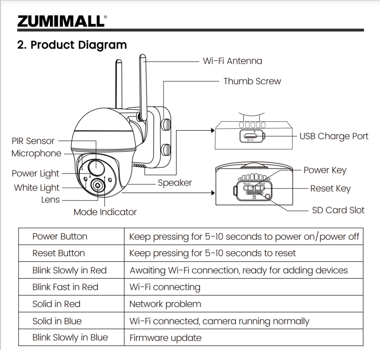
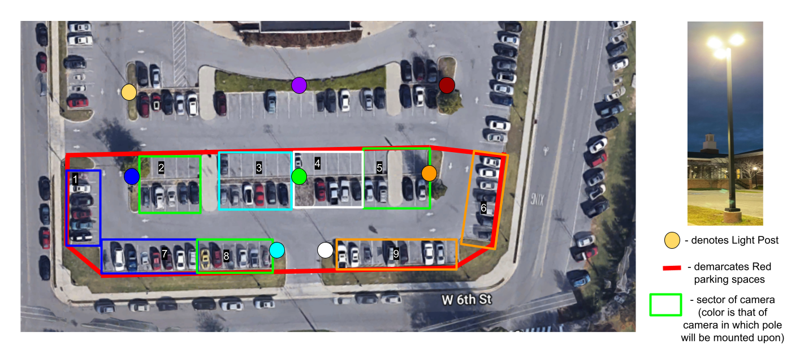
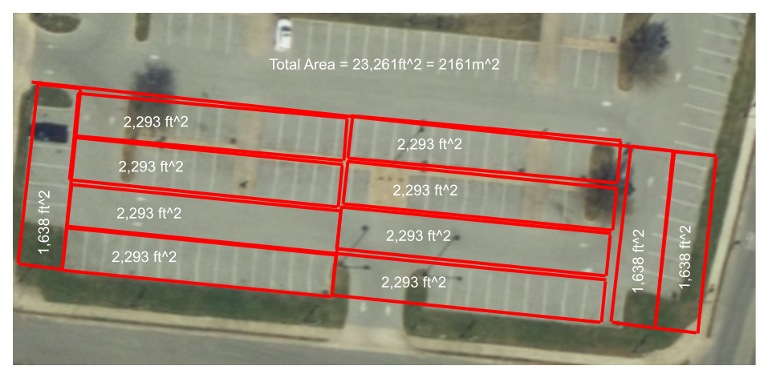

<h1>Detailed Design for Camera Subsystem within Primary Data Acquisition System</h1>

<h2>Big Picture</h2>

The primary data acquisition system will utilize real-time camera sensors to collect images of sectors of parking spots in the lot behind Bell Hall, in which these images will then be transmitted via wireless communication to a server where the images will be processed by an artificial intelligence (AI) algorithm to determine the number of Red parking spots that are filled and unfilled by cars. This subsystem is a critical subsystem because these cameras will provide the primary data to the system that will determine the count of vehicles in a lot. The images from these cameras will be sent over to the server to be processed by an artificial intelligence (AI) algorithm to determine the number of available parking spots in the Bell Hall lot. This number will then be cross-checked with that derived from the secondary acquisition system to determine its accuracy.

<h2>Specifications</h2>

1. Mounting
    * Attachment location
        * Light posts located around the parking lot (see Figure 2)
        * Light posts are 25 feet tall
    * Not allowed to drill into the posts
        * Hose clamp for block (mounting surface) to top of light pole
        * More refined mount will be designed by ME Team
    * Not allowed to add additional infrastructure (i.e. posts)
2. Monitoring
    * Cameras
        * All parking spots must be seen by cameras
        * Able to recognize car from feed
        * Have wireless communication to server
3. Maintainability
    * Should require minimum maintenance once installed
4. Power
    * All cameras will be solar powered to provide minimal maintenance
5. Communication
    * Wireless communication
        * Bluetooth not an option due to range	
        * WiFi
            * Need consideration of following factors:
                * Quality
                * Range
                * Downtimes

<h3>Analysis</h3>

1. Mounting
    * In order for the camera to operate correctly it will need to be mounted securely onto the light post. However, a constraint we received from facilities is that drilling holes in the pole is not allowed. Due to this we need a mounting method that does not require drilling and is adjustable in the event that we need to relocate the camera on the pole. For this reason we plan to use a hose clamp/vertical bracket combination similar to Dahua Technology pole mount bracket (MFR# PFA150). Currently we have not received pole diameter dimensions from facilities so the correct hose clamp size has not been determined. However, this is a minor issue that can quickly be resolved by either measuring the pole or receiving the information from facilities. Hose clamps have a wide size range that should satisfy our requirements.
    * The cameras shall be placed no less than 5 feet below the lights on the light posts to ensure that the emanating light is not obstructed at night. Although there is very little concern that the lights will affect the cameras during the system's hours of operation, the cameras shall be placed so that they do not obstruct the light at night.

]
<h3>Figure 1. Buildable PDF Schematic</h3>
 

2. Monitoring
    * The measurements for a single parking spot in the Bell Hall lot is 575 cm x 265 cm. Based on these measurements the whole area of the lot is then calculated in Figure 3.  The computer vision algorithms implemented [1] and [2] which detect and/or identify vehicles used training set images of the rear side of cars that were 64 x 64 pixels. A standard car is on average 5.8 feet [3], which translates to roughly a little over 10 pixels per foot (or 100 pixels per square foot) for these images of cars to be identified as such. Thus, the cameras must have a minimum pixels per foot of 10 pixels per foot (or 100 pixels per/square foot) to identify the presence of a car in a parking spot. Using 100 pixels/sq ft as a bare minimum for vehicle detection and mapping the area of the parking lot to be 23,261 sq ft. A total of 2.33 megapixels will be necessary for the whole lot. This includes the driving area, grass/shrubbery, and curbs around the area. Then, using the arrangement above, a total of nine cameras will be used. This suggests that each camera has a bare minimum resolution of 0.26 megapixels. The camera that we have chosen is 3 megapixels, which is above the required minimum.

<h3>Figure 2. Camera Arrangement</h3>

<h3>Figure 3. Bell Hall Lot Area</h3>

 

3. Communication
    * The camera that we have chosen has 2.4G WiFi/cloud capabilities, which will allow for wireless communication without any external devices.
4. Field of View
    * The camera that we have chosen has a 130 degree field of view and can pan up to 360 degrees horizontally and 120 degrees vertically. These features may not be utilized, but the camera was chosen due to the 130 degree field of view. The maximum angle needed in any one of the individual sectors is 87.96 degrees, so by choosing a camera that is able to observe much more area than that, we can accurately get readings of the desired regions. In addition, the furthest point that a single camera may have to monitor is roughly 80-100 feet, which would be within a typical recognition range for the camera[4],  and placing the camera as high as 20 feet would provide a high view to see cars at this distance, especially if (in worst case) a smaller car (like a Nissan Sentra) were next to a taller truck (like a Toyota Tacoma).
5. Maintainability
    * This camera was chosen due to it having “3-8 months of standby time only on battery power, plus the solar panel can quickly achieve 365-day non-stop protection”. This allows for minimal maintenance in respect to power. The camera is also IP66 waterproof (tested in high-pressure water conditions. 
6. Power
    * The camera has its own power system between the battery which can solely last 3-8 months without being recharged. Then, with the solar panel, it will be able to run year round. 

<h2>Camera Features</h2>

1. 2K Resolution
    * Has night vision options
        * Full color
        * Black & white
    * 130 degree field of view
2. Alarm
    * Configurations
        * Siren
        * Spotlight
    * Will not be utilized for project
3. Up to 4X digital zoom
    * May be used to better fit area to be scanned
4. Detection
    * Area to detect can be selected from stream
    * Features motion detection
        * Can create notifications
    * Configurable sensitivity level
        * 1 to 10
    * Can differentiate between people, pets, vehicles, and packages
5. Audio
    * Two way audio between app and camera
6. Power
    * 15000mAh rechargeable battery
    * Charged by solar panel
    * 3-8 month run time without charging
7. 4 dBi dual antenna
    * 2.4G WiFi
8. Storage
    * Support for Micro SD (max 128 GB) and cloud storage
    * Will not be used for project
9. Low battery notification
    * May be used to check power status of camera
10. Adjustable
    * Rotates up to 355 degree horizontal rotation
    * Rotates up to 120 degree vertical rotation
11. Durability
    * IP66 Weatherproof
    * Functional between -13 degree F to 140 degree F
12. Mobile App
    * Zumimall App
    * Allows configuration of cameras
    * Allows view of camera stream
    * Setup
        * Download app on mobile device
        * Reset camera
        * Have camera scan QR code on phone
        * Connect camera to internet

<h2>Cited Sources</h2>

[1] A. Gunzi, “Vehicle Detection and Tracking using Computer Vision,” _Chatbots Life_, 7 Mar 2017. [https://chatbotslife.com/vehicle-detection-and-tracking-using-computer-vision-baea4df65906](https://chatbotslife.com/vehicle-detection-and-tracking-using-computer-vision-baea4df65906)

[2] B. Djukic, “Detecting vehicles using machine learning and computer vision,” _Towards Data Science_, 25 Apr 2017. [https://towardsdatascience.com/detecting-vehicles-using-machine-learning-and-computer-vision-e319ee149e10](https://towardsdatascience.com/detecting-vehicles-using-machine-learning-and-computer-vision-e319ee149e10)

[3] S. Meyer, “STUDY: Average Car Size is Increasing – will roads still be safe for small cars and pedestrians?,” _The Zebra_, 2022. [https://www.thezebra.com/resources/driving/average-car-size/](https://www.thezebra.com/resources/driving/average-car-size/) 

[4] Duda, David, “Designing Video Surveillance Systems: Managing Owner’s Expectations,” _Newcomb & Boyd_, 2022. [https://www.newcomb-boyd.com/solutions/designing-video-surveillance-systems-managing-owners-expectations/](https://www.newcomb-boyd.com/solutions/designing-video-surveillance-systems-managing-owners-expectations/)

[5] “Security Cameras Wireless Outdoor, 2K ZUMIMALL 360° PTZ Outdoor Camera Wireless, Solar Security Cameras for Home, Spotlight & Siren/2.4G WiFi/3MP Color Night vision/2-Way Talk /PIR Detection/SD/Cloud,” _amazon.com_, 2022. [https://www.amazon.com/Zumimall-Security-Detection-Waterproof-Encrypted/dp/B092HPZJD5/ref=sr_1_2?crid=2ZK6O8X21WVLW&keywords=120%2Bdegree%2Boutdoor%2Bcamera&qid=1668026837&sprefix=%2Caps%2C81&sr=8-2&th=1](https://www.amazon.com/Zumimall-Security-Detection-Waterproof-Encrypted/dp/B092HPZJD5/ref=sr_1_2?crid=2ZK6O8X21WVLW&keywords=120%2Bdegree%2Boutdoor%2Bcamera&qid=1668026837&sprefix=%2Caps%2C81&sr=8-2&th=1) 

[6] “Multi-Camera Vehicle Tracking System for AI City Challenge 2022,” _CvF_, 2022. [https://openaccess.thecvf.com/content/CVPR2022W/AICity/papers/Li_Multi-Camera_Vehicle_Tracking_System_for_AI_City_Challenge_2022_CVPRW_2022_paper.pdf](https://openaccess.thecvf.com/content/CVPR2022W/AICity/papers/Li_Multi-Camera_Vehicle_Tracking_System_for_AI_City_Challenge_2022_CVPRW_2022_paper.pdf)
