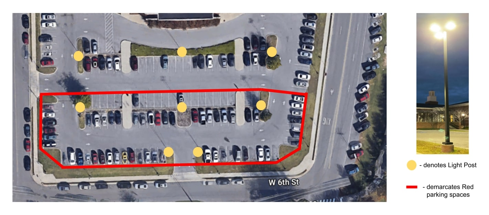
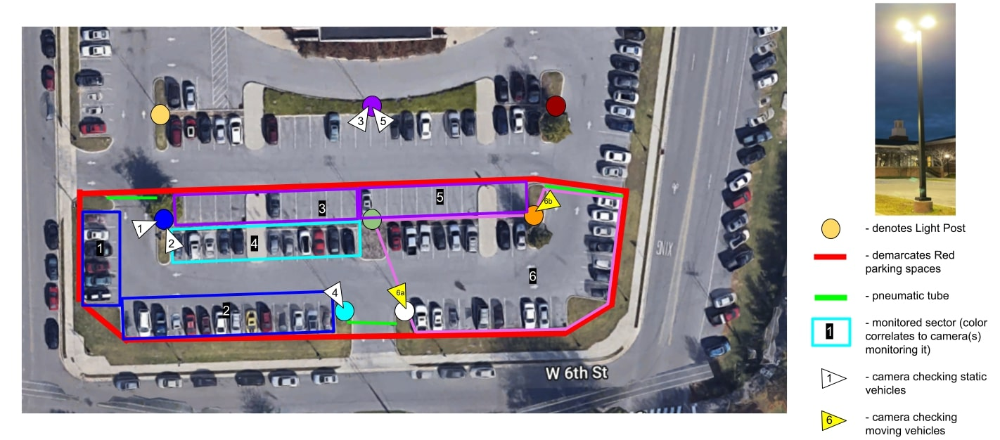
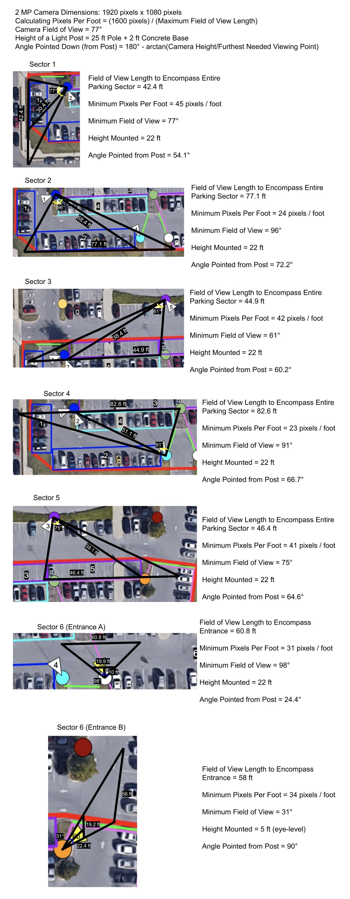
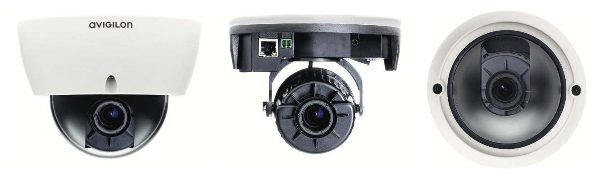
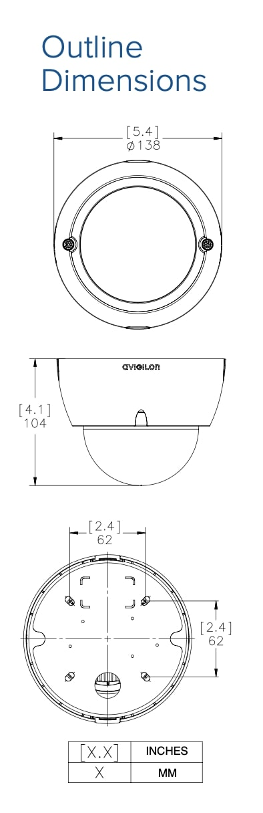
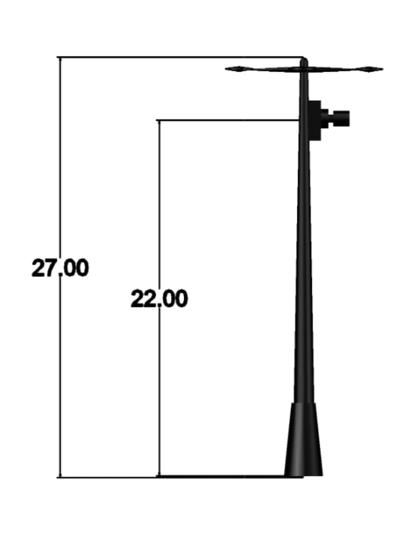

# Detailed Design for Camera Subsystem within Primary Data Acquisition System

## Function of the Subsystem

The primary data acquisition system will utilize camera sensors to determine the number of cars in the Bell Hall Lot. The cameras will utilize one of two methods for determining the parking count: tracking statically a parking lot sector or tracking dynamically the movement of cars into and out of a sector. These video feeds from these cameras will then be sent to a server where the images will be processed by an artificial intelligence (AI) algorithm to determine the number of cars and thus the number of available Red parking spots in the Bell Hall. This subsystem is a critical subsystem because these cameras will provide the primary data to the system that will determine the count of vehicles in a lot. The cameras is providing this input data to the server.

## Constraints

1. Placement and Performance of Cameras
  * Placing Cameras on Light Posts
    - Figure 1 shows the Red parking spaces in Bell Hall and the light posts scattered throughout the lot. The only approved places that the cameras could be mounted upon are the light posts shown in Figure 1, thanks to Facilities at Tennessee Tech. The City of Cookeville did not allow us to hook up cameras on the lamp posts outlining the sidewalk around the Bell Hall lot. In addition, creating additional infrastructure (i.e. inflatable posts) was also not allowed by Facilities. The light posts, which are 5” square steel and are 25 ft tall on top of a 2 ft cement block. They provide a simple flat surface for easy mounting.

 Figure 1. Red Parking Spots and Light Posts in Bell Hall Lot

  * Height on Light Posts
    - Although we are not concerned about the lights causing glare into the camera lens at night since these cameras are to only output valid data during the day, it can be a concern that having the cameras too close to the lights (see Figure 2 for a picture of the light posts) will cause the cameras to overheat. Thus, after consulting with Facilities, the maximum height in which cameras can be installed is 20 ft (22 ft counting the cement block) for the sake of the cameras. To maximize the field of range that the cameras can see, all cameras except Camera 6b will need to be placed at a height of 22 ft. It makes reasonable sense to have the cameras as high as possible to ensure the camera could see all cars, especially when there is some obstruction.
    - To address the worst-case scenario for the static lots, in which a tall car (e.g. a Toyota Tacoma roughly 7.67 ft) is next to a small car (e.g. a Nissan Sentra roughly 4.74 ft), with the small car in the further spot, to ensure at least 2.69 ft of the parking spot is visible, an angle of incidence from the 2.69 ft point to the camera of 22.7° (derived from the inverse tangent of 2.93 ft, the difference in height of the cars, divided by 7 ft, derived from assuming that the tall car is 1 ft from the parking spot boundary plus 6 ft of the parking spot the small car is in) is required, or a maximum angle that the camera can be pointed of 67.3°. This satisfies all static sectors except Sector 2; however, the frequency this scenario may occur (which is uncommon due to the prevalence of students driving SUVs) as well as that this may provide an error for one parking spot (compared with the acceptable margin of error with the secondary data acquisition system to be roughly 8 parking spots), shows that this risk is acceptable.
    - Due to the presence of a tree that "hugs" the light post adjacent to Sector 6, Camera 6b will need to be placed at an eye level of 5 ft (2 ft cement block plus 3 ft of the post) since this camera is intended for detecting vehicles as they pass by (the same applies to Camera 6a), rather than tracking static parking spots. As shown in Figure 1, this provides enough coverage to see a car coming into or exiting a lot.
    - The worst case scenario is that of in which a Tacoma is entering Sector 6 near the tree and a Sentra is exiting Sector 6 near the tree, in which for a time period the tall vehicle will obstruct the short vehicle. (We are assuming typical American road structures, in which you drive on the right side of the road, so entering the lot makes the car will occur closer to the camera and exiting the lot makes the car further from the camera.) However, due to the relative frames, because the vehicle entering the lot is very close to the camera, it will be on the video feed for a much shorter than the the vehicle exiting the lot, so it is highly probable that since a 31° FOV will lead to at least 56 ft of the visible parking spaces visible (and thus the demarcation in which a car can move through that entrance), the worst-case scenario will work itself out as the exiting short car will still be on the feed once the entering tall car is accounted for.
  * Attachment to Light Posts
    - Because drilling into posts is not allowed (as per Facilities), hose clamps will need to be used to mount the cameras. Please refer to Mounting for more information.
  * Casing
    - The casing must protect the cameras from vandalism, weather, birds, etc.
    - The casing also cannot obstruct the view of the lens of the cameras.
    - The casing will be designed by the Mechanical Engineering team. (If not, then the ECE will create the first prototypes of the casing to be later improved by the ME team.)
  * Day vs. Night Performance
    - The cameras are expected to perform properly during the day. However, because it has been specified that the entire system should only output the number of available spots during parking enforcement hours, which fall in the day with the exception of a few minutes during the Winter months (due to Daylight Savings Time bringing an early sundown), the cameras do not have to have night vision.

2.  Monitoring of Parking Spaces and Entrances
  * Sectoring of Bell Hall Red Lot
    - The parking lot behind Bell Hall has 78 Red parking spots. However, many surveillance systems and other vehicle detection systems have cameras that track a small number of spots, so it is reasonable to sector Bell Hall and have cameras fixated on certain sectors/spots.
    - Because of the lack of mountable spots for cameras surrounding the Bell Hall lot, it has been decided that multiple cameras will need to be placed to view certain sectors of the lot. Thus, Bell Hall has been apportioned into six sectors in a manner to balance the performance of the cameras and the costs since cameras are not inexpensive. The sectors were selected to ensure that if a sector is a statically tracked area (see below) that all parking spots are visible and that if a sector is a dynamically tracked area that entrances can be monitored properly.
  * Statically vs. Dynamically Tracked Parking Sector
    - A "statically tracked" parking sector is an in which the camera is set to view the parking spots; in other words, the objects of interest are not moving. The objects that the camera is trying to track are non-moving cars in parking spots.
    - A "dynamically tracked" parking sector is an area in which the camera is determining if a car is entering or exiting that sector, in which a camera has to be placed at each entrance. The objects of interest are moving and their direction must also be noted (i.e. whether the car is entering or exiting the lot).
  * Number of Needed Cameras
    - It has been determined that dividing up the Bell Hall lot into 6 sectors, 5 statically tracked lots and 1 dynamically tracked lot, is the the optimal allocation of cameras to minimize cost while maximizing coverage. Because cameras are not inexpensive, it is imperative that a minimal number of cameras be used but enough to account for all spots, either directly (statically tracked) or indirectly (dynamically tracked). Thus, 7 cameras in total are needed.
    - Although it would be ideal to have cameras placed so that the cameras can track a static parking spot and determine if it has or does not have a car, Sector 6 has proven to be difficult to mount a camera at the top of the light post most adjacent to it (see Figures 2 and 3) since there is a tree that "hugs" the light post. Whenever it will be summer, the foliage will cover a majority of the light post; thus, the only possible mounting area in which leaves and branches do not obstruct the camera lens is eye-level of 5 ft. In addition, putting a camera on other light posts surrounding Sector 6 will prove too difficult in terms of pixels per foot, angle of camera, and field of view. Thus, Sector 6 has been deemed to be a dynamically tracked parking sector in which cameras will have to be stationed at both ends of the sector to monitor the cars coming in and out of the sector, two cameras total.
    - For the statically tracked sectors, 1 camera will be allocated to each sector, for a total of 5 cameras for these 5 sectors. The sectors were chosen to minimize the minimum field of view and resolution needed for the cameras. The analysis shown in Figure 3 shows more of the validation of the sectors.

 Figure 2. Bell Hall Red Zone Divided Up into Sectors

3. Mounting
  * The mounting will be taken care of by a separate subsystem. This will include a mount to the pole as well as the mount to the cameras. The selected mounting must be able to handle the weight of the cameras and whatever is powering the cameras.

4. Maintainability
  * These cameras will require minimum maintenance once installed, and there should be a way to “recalibrate” the cameras remotely without having to physically access the cameras.

5. Minimum Field of View and Minimum Resolution
  * Minimum Field of View
    - The cameras need to be able to have a field of view that could view all parking spots in Sector 1 through 5, as well as see a moving car right near the cameras at the entrances of Sector 6. The measurements used for the length and width of a car/parking spot are the measurements of a parking spot in Bell Hall, which were determined to be to be 18.87 ft x 8.69 ft (575 cm x 265 cm). The measurements of the minimum field of view needed for each sector (static sectors 1 to 5 and dynamic sector 6, with entrance cameras denoted as 6a and 6b) can be seen in Figure 3 below. Overall, a field of view of 98° is needed for this system.
    - For static Sectors 1 through 5, an overall minimum field of view of 96° is needed. The field of view was determined by finding the angle needed to see all of that sector's parking spots in entirety. In order, a field of view of 77°, 96°, 61°, 91°, and 75° are needed to see all of the parking spots in Sectors 1, 2, 3, 4, and 5, respectively. Thus, an FOV of 96° is needed to view all of the spots in the static parking lots. We believe that a minimum field of 96° is a reasonable needed FOV that balances the number of cameras (which are not inexpensive) and their performance. Please consult the constraints on Positioning of Cameras and Figure 2 for more on the sectoring of the Red zone of Bell Hall lot.
  * Minimum Resolution
    - To determine a minimum resolution of the cameras, it was necessary to research other computer vision efforts to identify vehicles and the resolution in which the training and testing images were. The computer vision algorithms implemented in [1] and [2] which detect and/or identify vehicles used training set images of the rear side of cars that were 64 x 64 pixels. A standard car is on average 5.8 feet [3], which translates to roughly a little over 10 pixels per foot (or 100 pixels per square foot) for these images of cars to be identified as such. Thus, the cameras must have a minimum pixels per foot of 10 pixels per foot (or 100 pixels per/square foot) at the furthest spot in which a car can be seen from the camera to identify the presence of a car in a parking spot since these AI algorithms are able to identify/detect vehicles at this pixel per foot. It is understood that a camera will not concentrate all of its pixels onto the needed area (i.e. cars), which is why the 10 pixels per foot applies to the furthest point in which a car can be seen, and this "line" must span the minimum field of view required for that sector.
    - Pixels per foot can be calculated by dividing the number of horizontal pixels (the first number in a resolution, i.e. the H in (H) x (V)) by the distance. Figure 1 shows the minimum pixels per foot calculations performed on a 1080p camera, which has a resolution of 1920 x 1080. As seen in Figure 1, a 1080p provides at least 10 pixels per foot for cars in all statically and dynamically tracked sectors (1 through 6). However, a 2 MP camera, which is slightly lower resolution at 1600 x 1200 [4], also provides a sufficient the sufficient 10 pixels per foot.

 Figure 3. Minimum FOV and Resolution Requirements for Each Sector in the Bell Hall Red Zone

## Buildable Schematic

 Figure 4. Selected Avigilon Dome Cameras

 Figure 5. Dimensions of Avigilon Dome Camera

 Figure 6. Mounting of Cameras on Light Posts

## Analysis

1. Selected Camera
  * Camera to Be Used: Avigilon 2.0 Megapixel Day/Night H.264 HD Indoor Dome Camera

2. Meeting Minimum Field of View and Resolution
  * The Avigilon Indoor Dome Camera has a field of view of 98°, which matches our minimum FOV needed to see all cars in the static sectors 1-5 as well as a car close-up to the cameras at the entrances of Sectors 6.
  * The cameras also have a resolution of 2 MP and an active pixels of 1920 x 1080, which satisfies the minimum resolution needed to provide 10 pixels per foot for all cars that can be seen by the cameras.

3. Day vs. Night Performance
  * Because these cameras are indoor cameras, they are meant to be used with light, thus meaning they can see during the day.

4. Attainability
  * An important note is that these cameras can be obtained from the Information Technology Services (ITS) for no charge, and ITS is willing to provide us the number of cameras needed (7). Thus, even though the sectoring of the parking lots were created to minimize the cost of cameras, still we can obtain the number of cameras to cover the entire Bell Hall Lot.

5. Mounting and Casing
  * The dimensions of the camera is 138 mm x 104 mm (5.4” x 4.1) with a weight of 0.53 kg (1.17 lbs). Thus, it is highly reasonable to expect that these cameras are light enough to be mounted and small enough to create a suitable casing.

## Bill of Materials

| Name of Item | Description | Used in which subsystem(s) | Part Number | Manufacturer | Quantity | Unit Price | Total |
| ------------ | ----------- | -------------------------- | ----------- | ------------ | -------- | ---------- | ----- |
| Avigilon 2.0 Megapixel Day/Night H.264 HD Indoor Dome Camera | Camera | Primary Data Acquisition | 2.0-H3-D1 | Avigilon | 7 | $0.00 | $0.00 |
| | | | | | | | **$0.00** |

  * Note: ITS will be supplying these cameras, hence the cost of $0.00.

## Cited Sources

[1] A. Gunzi, “Vehicle Detection and Tracking using Computer Vision,” _Chatbots Life_, 7 Mar 2017. [https://chatbotslife.com/vehicle-detection-and-tracking-using-computer-vision-baea4df65906](https://chatbotslife.com/vehicle-detection-and-tracking-using-computer-vision-baea4df65906)

[2] B. Djukic, “Detecting vehicles using machine learning and computer vision,” _Towards Data Science_, 25 Apr 2017. [https://towardsdatascience.com/detecting-vehicles-using-machine-learning-and-computer-vision-e319ee149e10](https://towardsdatascience.com/detecting-vehicles-using-machine-learning-and-computer-vision-e319ee149e10)

[3] S. Meyer, “STUDY: Average Car Size is Increasing – will roads still be safe for small cars and pedestrians?,” _The Zebra_, 2022. [https://www.thezebra.com/resources/driving/average-car-size/](https://www.thezebra.com/resources/driving/average-car-size/)

[4] "A Practical Guide to CCTV Video Resolutions," _Optiview_, 2022. [https://optiviewusa.com/cctv-video-resolutions/](https://optiviewusa.com/cctv-video-resolutions/)

# Revisions

11/15/2022 - Addressed previous comments by adding CAD schematics of cameras, more in-depth analysis of required field-of-view, re-scoping of this detailed design to just camera selection

11/19/2022 - Re-arranged information so that specifications section actually have specifications and analysis verifies that the cameras meet those specifications

11/20/2022 - Fixed broken links in markdown file

11/29/2022 - Reformatted signoff so that constraints are adequately mentioned with new information. Analysis only shows how
