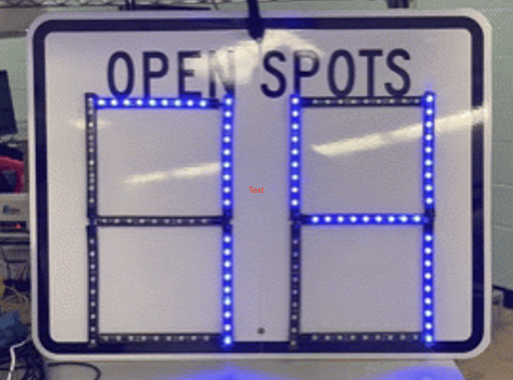
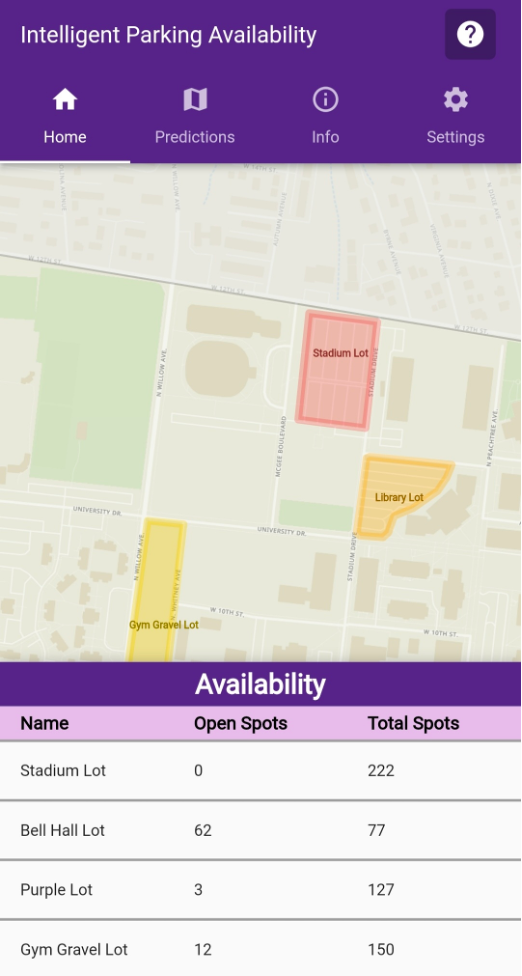
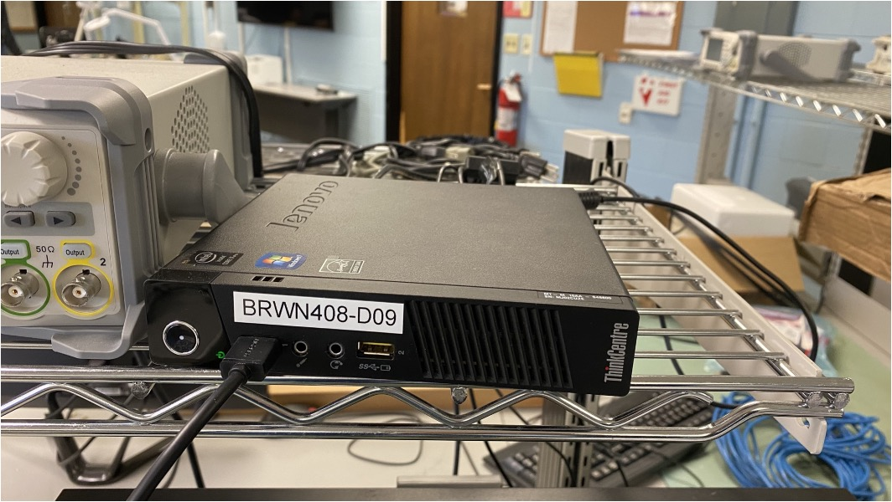
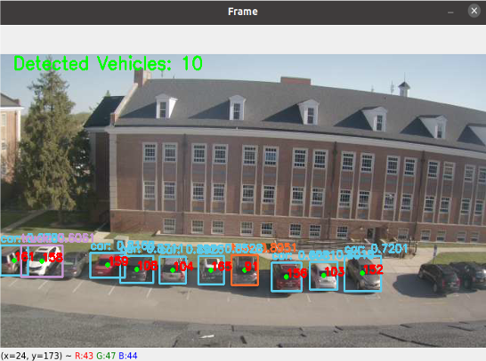
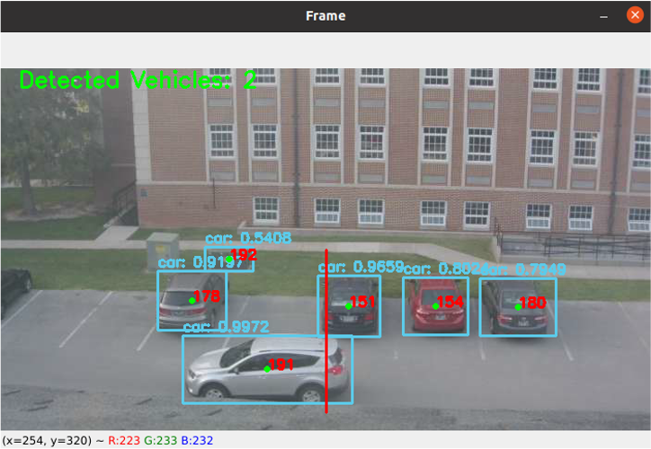

# Parking Lot Monitoring System

## Executive Summary

Students commuting to Tennessee Tech have difficulty finding open parking spots during busy hours of the school day, which causes tar- diness to class. To solve this problem, our team’s goal was to design a proof of concept for a parking lot monitoring system that uses visual sensors that determine the amount of open spots to be displayed in real-time on a downloadable mobile application and an outdoor sign.

This project involves interdisciplinary collaboration between teams from the Departments of Electrical and Computer Engineering, Computer Science, and Mechanical Engineering while under the direction of the Naval Sea Systems Command (NAVSEA) in Dahlgren, VA.

## Capabilities

As a proof of concept, the primary goals of the project are to:
  * Successfully identify and count vehicles parked in spots
  * Successfully identify and count vehicles moving in and out of a lot
  * Display the correct parking availability count on the sign
  * Send and receive the correct data from the database
By being able to meet these goals, we believe that we can prove a system capable of monitor parking lot availability on Tech’s campus using only cameras should be feasible to fully implement.

## Salient Outcomes

1. AI algorithms can be used to process images from video cameras to monitor the number of available parking spots, though the accuracy of these algorithms will need to be improved through both software and hardware improvements.
2. The first iterations for a mobile application and a sign have been built as user interfaces for students to see the number of available parking spots in a given lot.

## Project Demonstration & Images

A demonstration of the project can be viewed here: [https://youtu.be/3_bB4dtKVq0](https://youtu.be/3_bB4dtKVq0).

Videos of specific subsystem tests can be viewed in the [Experimental Analysis](Reports/ExperimentalAnalysis.md) markdown file.

The following images are components of the project:

 Cameras

The cameras were tested by being connected via Ethernet to the server and looking out a window of the Capstone lab from the fourth floor of Brown Hall.

 Sign

The goal of the sign is to allow students to see the number of available parking spots as they enter a lot on campus.

 Sign

The mobile application allows students to see the number of available parking spots on their phones before they leave for campus.

 Server

This server was given to the project by ITS.

 Static Tracking

The static tracking model counts the number of cars in the frame, as seen in the overlay above.

 Dynamic Tracking

The dynamic tracking model detects if a car has crossed a virtually drawn line, as seen in the overlay above.

## About Us

### Team

**Kester Nucum** is a senior Computer Engineering major at Tennessee Technological University with double minors in Music Performance and Honors. Kester's interests in Electrical and Computer Engineering include artificial intelligence, digital signal processing, and applications in radar and RF technology. He has spent two summers as an intern at Dynetics in Huntsville, AL, where he worked in modeling and simulation of foreign weapons threat systems, and he plans to obtain a Master's Degree in ECE prior to starting a career in the defense industry. For the Parking Lot Monitoring System project, Kester primarily focused on the design regarding the cameras in the primary data acquisition system and the hardware for the server, and he was in charge of programming the static and dynamic tracking AI models. Outside of classes, Kester serves as the President of the Tennessee Gamma chapter of Tau Beta Pi, plays violin in the University Orchestra, and is active in University Catholic.

**Aaron Wilhite** is a senior Electrical Engineering major at Tennessee Technological University with a minor in Math. He spent the previous year at a co-op with EOSYS in Smyrna, TN doing custom system integration. During this co-op he gained experience in HMI design and PLC (Programmable Logic Controller) programming. For the Parking Lot Monitoring System project, Aaron designed, built, and programmed the sign. Outside of classes, Aaron spends most of his time rock climbing and camping.

**Gabriel Laboy** is a senior Computer Engineering major with a minor in Computer Science at Tennessee Technological University. His interests include digital systems, virtual reality (VR), and cyber security. He spent a whole year as a co-op at EOSYS located in Smyrna, TN, and later plans to pursue a Master's Degree in Computer Science in hopes of being a professor of university. Gabriel's role consisted of assisting with technical and programming support, leading experimental analysis, and promoting collaboration with the Computer Science (CSC) team to ensure successful operation of the mobile application with the server. He is also currently serving as the Vice Chair of the student chapter of the Institute of Electrical and Electronics Engineers (IEEE), and will serve as the Recording Secretary of the Tennessee Gamma chapter of Tau Beta Pi in the spring.

**Genevieve Schreiber** is a senior Computer Engineering major at Tennessee Technological University with a minor in Mathematics. Her interests involve FPGAs, embedded systems, and space. She has spent 1 year interning at ALTEN as a software intern working in embedded systems. She plans to work in space-adjacent fields post-graduation. For this Parking Lot Monitoring System, Genevieve focused on the networks involved between the many devices used. She is also part of the Omega Phi Alpha national service sorority.

**Reggie Garza** is a senior electrical engineering major at Tennessee Tech University. Reggie's interest include robotics and automation. He has spent the last two years interning at ATC Automation in Cookeville,TN. There he has been part of a team of engineers and has contributed with the electrical design and programming of several machines. Reggie helped design the data acquisition systems, provide technical support, and test the AI models.

### Faculty Supervisor

**Jesse Roberts** is a Lecturer in the Department of Electrical and Computer Engineering at Tennessee Technological University. He received both his Bachelor's and Master's Degrees in Electrical Engineering from Tennessee Tech, and he is currently working on obtaining his Doctorate of Philosophy in Computer Science from Vanderbilt University, anticipated May 2023. He is the instructor for the ECE 4961 Capstone I and ECE 4971 Capstone II courses at Tennessee Tech, and he serves as the faculty supervisor for the Parking Lot Monitoring System project. His research interests include Game Theory and Mechanism Design, Graph and Learning Theory, Spiking Neural Networks, Computational Sustainability, Computational Creativity and Criticism, and Automation. In his free time, Jesse loves to go rock climbing.

### Stakeholders

The **Naval Surface Warfare Center Dahlgren Division** in Dahlgren, VA, under the Naval Sea Systems Command, more commonly referred to as **NAVSEA**, is the primary customer of this project. The NSWC Dahlgren Site is a premier research and development center that serves as a specialty site for weapon system integration. Engineers and scientists focus on providing research, development, test and evaluation, analysis, systems engineering, integration, and certification of complex naval warfare systems related to surface warfare and strategic systems. NAVSEA engineers, builds, buys and maintains the ships, submarines, carriers (unmanned systems) and combat systems that patrol the oceans and secure American shores.

The major stakeholder that will be affected by this project are the **commuter students** of Tennessee Tech since this project is designed with them in mind. We hope that this project will help commuter students (students who drive to campus and possess a Red parking pass) plan out their parking routines more effectively and also know of alternate spots to park on campus, albeit if those spots are more inconvenient/out of the way.

Another major stakeholder is **Tennessee Tech** itself because the data collected from this system--the parking history of lots throughout the day--can be potentially used for future planning and zoning purposes. This data can prove to be valuable in collecting data about student parking behaviors since campus parking is an evergreen problem that persists at Tennessee Tech.

### Recognitions

We first would like to thank Kristen Voyles and Rob Sexton at NSWC Dahlgren for their mentorship about the engineering design process throughout the entire capstone process. Their feedback and advice were invaluable, not just for the project but for us as future engineers as well.

Thank you to our advisor Jesse Roberts for all of his guidance throughout all of Capstone!

We would like to thank the Office of Parking and Transportation, University Police, and Facilities at Tennessee Tech for allowing to implement this project on campus.

Also, thank you to WUCT - News Talk 94.1/AM 1600 for featuring our project on your station! We are excited that the community is excited about our project. Go check out the news article here: ["TTU Capstone Students Working To Develop Program To Better Parking"](https://newstalk941.com/ttu-capstone-students-working-to-develop-program-to-better-parking/).

## Repo Organization

### Reports

All reports about the project holistically can be found in the [Reports](/Reports) folder. The major files in the Reports section are as follows:

1. [Project Proposal, version 1](/Reports/ProjectProposal_v1.pdf)
2. [Project Proposal, version 2](/Reports/ProjectProposal_v2.pdf)
3. [Conceptual Design and Planning](/Reports/ConceptualDesign.pdf)
4. [Poster](/Reports/Poster.pdf)
5. [Final Presentation](/Reports/FinalPresentation.pptx)
6. [Lessons Learned](/Reports/LessonsLearned.pdf)
7. [Individual Technical Presentations](/Reports/IndividualPresentations.pdf)

### Documentation

All signoffs, electrical schematics, 3D models, and bill of materials (BOM) and other documentation such as images, the project datasheet, and project poster can be found in the [Documentation](/Documentation) folder. The major folders in the Documentation section are as follows:

1. [Signoffs](/Documentation/Signoffs)
  * Signoffs are written for each subsystem in which each subsystem's design is analyzed in light of the constraints to ensure their functionality prior to ordering their components. Signoffs once approved will be stored here.
2. [Electrical](/Documentation/Electrical)
  * The Electrical folder will contains two folders: [PCB](/Documentation/Electrical/PCB) and [Schematics](/Documentation/Electrical/Schematics). The PCB folder contains all designs for printed circuit boards (PCBs) that are custom built for this project. The Schematics folder contains all buildable wiring schematics for analog circuits designed for this project.
3. [Images](/Documentation/Images)
  * Images for the project, such as images of the project when built, images used for signoffs, etc.
4. [3D Models](/Documentation/3D&#32;Models)
  * Buildable 3D model schematics for each constructed system of the project.
5. [Final Bill of Materials](/Documentation/BOM)
  * All components ordered compiled to generate the total cost for building this project.
6. [Prototype](/Documentation/Protoype)
  * Negotiated prototype requirements and substitutions made.

### Software

There are two major groups of software programs that have been written for this project, and both of these are stored in the [Software](/Software) folder.

1. [Static and Dynamic Tracking AI Models](/Software/AI_Models)
2. [Sign](/Software/Sign)
