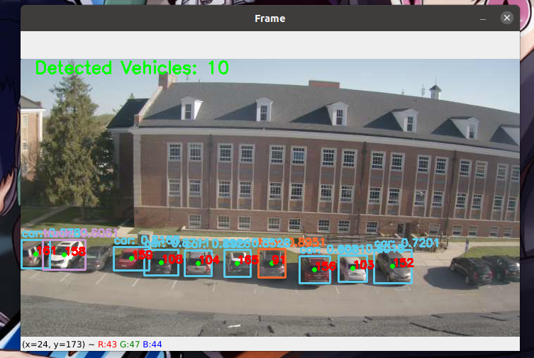
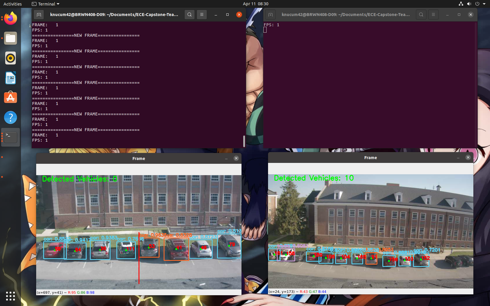
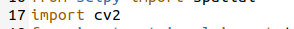
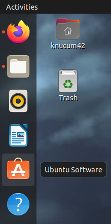
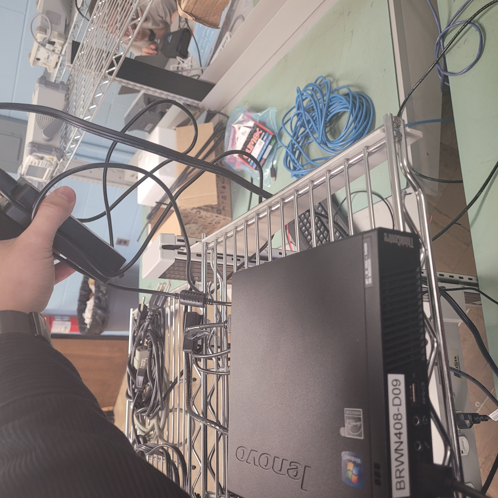

# Experimental Analysis Report

## Introduction

The purpose of this report is to check if all requirements for the project are met and detail the experimental procedures used for each one to test and validate results. The results will then be compared against the stated measures of success to determine what parts of the project’s implementation were successful, and what needs to be improved moving forward.

## Specifications and Constraints

### Requirements Table

| ID | Specification/Constraint | Applicable Subsystems | Reason for Rescoping |
| -- | ------------------------ | --------------------- | -------------------- |
| 1 | Seven-segment display must be able to output numbers 00 to 99 | Sign | N/A |
| 2 | Sign must utilize microcontroller with 14 digital pins | Sign | N/A |
| 3 | Sign must have circuit capable of switching LEDs on and off using digital pins of microcontroller | Sign | N/A |
| 4 | Sign must be large enough to hold LEDs displaying value | Sign | N/A |
| 5 | Must utilize microcontroller with serial communication | Sign | Originally planned to use wireless communication module with microcontroller which did not arrive, so serial communication was done |
| 6 | LEDs must be powered on by external power supply | Sign | Originally planned to be used in tandem with a power subsystem which design was not completed for, so it will be tested with a power supply |
| 7 | The system is expected to perform properly during clear daylight hours covering parking enforcement hours of 7:30AM to 4:30PM | Cameras, Server, Sign | N/A |
| 8 | Sign shall reflect number of available parking spots stored in remote database during system operational hours | Cameras, Server, Sign | N/A |
| 9 | Cameras must have a minimum of 10 pixels per foot at the furthest spot in which a car can be seen | Cameras | N/A |
| 10 | Minimal 5 frame per second camera will be needed to capture dynamic tracking | Cameras | N/A |
| 11 | Cameras must have a minimum field of view of 98°, which would allow the cameras to see up to 13 cars horizontally in a single frame | Cameras | N/A |
| 12 | Need to have two cameras simultaneously monitoring lot | Cameras | N/A |
| 13 | Cameras must be able to supply video feed, or at minimum a series of images to the server, via Ethernet | Cameras | Original plan was to have seven cameras monitoring lot, but was changed to two cameras to save on budget |
| 14 | Static AI model shall reflect a number within ±1 cars of the total number of cars in the parking lot | Server | Originally was planned to transfer wirelessly, but due to ordered wireless communication modules not coming in, was changed to ethernet |
| 15 | Server shall run an AI model that dynamically tracks a parking sector, i.e. the camera tracks the number and direction of moving cars crossing a certain area | Cameras, Server | Rescoped from static tracking of multiple sectors across the Bell Hall lot (cumulative accuracy across all models) to proof of concept that static tracking works for a single model. Also rescoped from being compared to the secondary data acquisition system to experimentation with truth data. Also ±5% accuracy on tracking less than 20 cars in single camera is less than 1 car, so accuracy is rounded up to ±1 car |
| 16 | Server shall run the YOLO algorithm with either OpenCV or Darknet | Server | Instead of tracking multiple entrances, the model will be implemented for proof of concept |
| 17 | Server must be able to run Linux | Server | N/A |
| 18 | Server will not store any images or video footage from cameras | Server | N/A |
| 19 | Server must be able to be powered via a wall socket and run 24/7 | Server | N/A |
| 20 | Server components must be compatible with each other | Server | N/A |
| 21 | Server must allow for GPU-enabling/CUDA-enabling to run AI algorithms | Server | N/A |

### Descoped Requirements Table

| Specification/Constraint | Applicable Subsystems | Reason for Descoping |
| ------------------------ | --------------------- | -------------------- |
| Sign must be dustproof and waterproof | Sign | Due to time constraints, the sign will not be used outdoors for this iteration of the project |
| Sign must be viewable outside in daylight | Sign | Due to time constraints, the sign will not be used outdoors for this iteration of the project |
| Must utilize microcontroller with RX/TX pins | Sign | Originally planned to use wireless communication module with microcontroller which did not arrive |
| Sign must be large enough to hold sign controller components | Sign | Due to time constraints, the sign will not be used outdoors for this iteration of the project, therefore casing of controller components was not done |
| Must withstand poor weather conditions (e.g. stormy, heavy winds) | Sign | Due to time constraints, the sign will not be used outdoors for this iteration of the project |
| Cameras will be placed 20ft up on light posts around Bell Hall parking lot | Cameras | Due to hardware not coming in, the cameras will not be mounted onto poles |
| Cameras must be encased from vandalism, weather, birds, etc. | Cameras | The cameras are no longer being placed onto the light poles outside so casing was not implemented |
| Camera casing cannot obstruct view of the camera | Cameras | The cameras are no longer being placed onto the light poles outside so casing was not implemented |
| Cameras must have a method to recalibrate remotely | Cameras | The selected cameras cannot support a method of remote recalibration |
| Server shall be able to communicate with remote server via Wi-Fi | Server | Server was supposed to connect with all subsystems via Wi-Fi; however, the Wi-Fi devices for these subsystems either were not ordered or did not arrive |
| Server shall store processed data such as parking availability counts and parking availability average | Server | The database was changed to a remote cloud-based database developed by the Computer Science team so it is no longer hosted on the server |
| Server shall get and store local weather data to determine if weather related notifications should be sent to mobile application | Server | This part of the project was descoped due to not having sufficient time to complete |

### Descoped Subsystems Table

| Subsystem | Reason for Descoping |
| --------- | -------------------- |
| Temporary Casing | The temporary casing was descoped due to rescoping of project deliverables which removed the expectation to have something mountable outdoors for the primary data acquisition system. Therefore, the temporary casing was no longer needed and cannot be tested |
| Heat Module | The heat module was descoped due to rescoping of project deliverables which removed the expectation to have something mountable outdoors for the primary data acquisition system. Therefore, the heat module was no longer needed and cannot be tested |
| Secondary Data Acquisition | Due to budget constraints for the project and many of the subsystems having high costs, it was decided to descope the secondary data acquisition system to save money and was deemed to be unnecessary given that its intended purpose could easily be replicated by counting vehicles in person |
| Wireless Communication | Wireless communication modules were ordered but never came in, so it was descoped from the project |
| Power | Power subsystem design remained incomplete for a long period of time, and given its significant delay that passed the deadline for submitting a BoM, it was descoped from the project |

## Experimental Results

### Constraint 1 - Sign Displays Numbers 00 to 99

Experimental Design
  * The objective of this experiment is to test that the LED strips oriented into two seven-segment displays on the custom-made sign can output all integer numbers from 0 to 99 on request from a program. The experiment will be done by writing a program that iterates through integer numbers 0 to 99, and for each number configure the necessary digital pins on the microcontroller to power on the correct LED strips to make the corresponding number display. A recording of the sign going through this iteration twice will be done as proof of experimentation.

Results

Link to Demonstration Video: [https://youtu.be/sfKp2QIJkJU](https://youtu.be/sfKp2QIJkJU)

| Iteration | Passed Numbers | Failed Numbers | Comments |
| ----------| -------------- | -------------- | -------- |
| 1 | 00 to 99 | NA | None |
| 2 | 00 to 99 | NA | None |

Interpretation of Results
  * All numbers from 00 to 99 were properly displayed in both iterations, indicating that the sign demonstrates proper pin mapping to each segment of the LED strips and all hardware works as intended. Therefore, the experiment is considered a success as it met what was specified in the constraint.

### Constraint 2 - Sign Uses Microcontroller with 14 Digital Pins

Experimental Design
  * Given that there are 14 LED strips that need to be powered on or off, a microcontroller with 14 digital pins will be necessary to interface to a circuit to determine when strips should be enabled or disabled. This will be tested by validating the selected microcontroller, an Arduino Mega 2560 Rev3, has at least that many digital pins according to its datasheet.

Results

  * As seen in table 5.2 of the Arduino Mega 2560 Rev3 datasheet, the board has a total of 22 Digital/GPIO pins [1].

Interpretation of Results
  * The datasheet explicitly states the hardware of the microcontroller includes 22 digital pins which exceeds the minimum 14 required of the constraint, therefore satisfying this constraint.

### Constraint 3 - Sign Has Circuit Connecting LED Strips, Microcontroller, and Power Supply Together to Ensure Sign Output is Correct

Experimental Design
  * The objective of this experiment is to demonstrate the circuit designed to connect the LED strips with the microcontroller and power supply to display proper numerical values when instructed. This experiment will be the same experiment used for Constraint 1, as proper display of numbers 00 to 99 implies the circuit designed for this experiment also functions as intended.

Results
  * See Results section for Constraint 1.

Interpretation of Results
  * As seen in the results from the experiment for Constraint 1, the sign was able to output numbers 00 to 99 without issue for two iterations. Therefore, it can be proven the circuit designed functioned as intended to ensure the numeric outputs for that experiment were correct.

### Constraint 4 - Sign is Large Enough to Hold LED Strips

Experimental Design
  * The board holding the LED strips must be sufficiently large enough to have the LED strips not hang off the sign. This will be tested by visual verification once the sign has had the LED strips attached to the board, which are fulfilled by the proper working of the experiments for Constraints 6 and 8.

Results
  * Consult the video for the experiment of Constraints 6 and 8 for what the sign looks like with the LED strips.

Interpretation of Results
  * As seen in these videos, the LED strips fit the sign without the strips hanging off demonstrating fulfillment of the constraint.

### Constraint 5 - Sign Uses Microcontroller with Serial Communication

Experimental Design
  * Given that data from the database can only be read when connected to the internet, the microcontroller must be capable of serial communication so it can be connected to a computer that can read from the database to get the needed parking availability count for display on the sign. This will be tested by validating the selected microcontroller, an Arduino Mega 2560 Rev3, has a method of serial connection according to its datasheet.

Results
  * In section 3.3 of the datasheet, it is explained that there is a USB serial processor (ATmega16U2) to interface between anything connected to the on-board USB and the microcontroller’s main processor [1].

Interpretation of Results
  * The datasheet explicitly states the hardware of the microcontroller has both a USB port and USB serial processor on board capable of serial communication between itself and a connected device, therefore satisfying this constraint. More so, the experiment for Constraint 8 verifies this functionality since the sign microcontroller is connected to a PC, and the microcontroller is receiving information from the PC.

### Constraint 6 - Sign LED Strips are Powered On by External Power Supply

Experimental Design
  * The LED strips require an external power supply with sufficient power output in order to be powered on. This will be demonstrated by connecting a power supply to the sign’s circuit being turned on and off which should consequently turn on and off the LEDs.

Results

Link to Demonstration Video: [https://youtu.be/WmBuO32049o](https://youtu.be/WmBuO32049o)

  * The above video demonstrates the power supply being turned on and off and the resulting effect on the LEDs.

Interpretation of Results
  * As seen in the video, everytime the power supply was turned on to supply power to the LED strips, the strips powered on, and when turned off, the stips powered off. Therefore, this satisfies the constraint.

### Constraint 7 - System Functionally Operational During 7:30 a.m. to 4:30 p.m.

Experimental Design
  *  This constraint requires that the entire system is operational during the parking enforcement hours of 7:30 a.m. to 4:30 p.m. More specifically, the cameras should be able to provide images to the server, the server should process these images to obtain the number of cars in the parking lot, and the sign and mobile application should output the number of available parking spots during this time.
  * This constraint can be verified by other experiments that have been performed, including:
    - Experiment for Constraint 13: Static camera performance is measured at varying intervals on a clear, sunny day from 8 am to 4:30 pm.
    - Experiment for Constraint 14: Dynamic camera performance is measured at varying intervals on a clear, sunny day from 8 am to 4:30 pm.
    - Experiment for Constraint 8: The number outputted on the sign is measured and compared to the number on the remote database at varying intervals from 8 am to 4:30 pm.

Results and Interpretation of Results
  * According to the above experiments, the static camera and AI model was able to detect cars during this time frame, albeit not the correct number. The dynamic camera and AI model were able to detect cars going across a virtual line on the frame, though not all the time due to frame processing limitations. The sign was able to output the current or very recent number of available parking spots as reflected on the database. Therefore, the system is operational in the sense that it is collecting inputs, processing those inputs, and providing the right outputs during this intended time. The accuracy and performance of these systems are addressed in their respective experiments.

### Constraint 8 - Sign shall reflect number of available parking spots stored in remote database during system operational hours

Experimental Design
  * The objective of this experiment is to determine if the sign reflects the number of available parking spots in the remote database and determine any causes of error or lag. The sign should output the number of available parking spots in an accurate and timely fashion.
  * This experiment will be performed by monitoring the number of open spots displayed on the sign, the number of open spots displayed on the mobile application, and the number of open spots displayed on the database between the hours of 7:30 a.m. and 4:30 p.m. at 30 minute intervals on a single day. This experiment is performed simultaneously as the experiments for Constraints 13 and 14 since the outputs from these experiments will be sent to the remote database to determine a simulated number of cars in the Bell Hall parking lot. The difference between the sign and the remote database will be calculated as the number on the sign minus the number in the database at that exact time.

Results

Link to Demonstration Video: [https://youtu.be/c0jrcfhQ37Y](https://youtu.be/c0jrcfhQ37Y)

| Time | Number in Database | Number on Sign | Difference |
| -----| ------------------ | -------------- | ---------- |
| 8:12 am | 67 | 67 | 0 |
| 8:30 am | 67 | 67 | 0 |
| 9:00 am | 68 | 67 | -1 |
| 9:25 am | 66 | 67 | 1 |
| 10:40 am | 66 | 65 | -1 |
| 11:00 am | 67 | 68 | 1 |
| 11:30 am | 68 | 67 | -1 |
| 12:00 pm | 68 | 68 | 0 |
| 12:34 pm | 69 | 66 | -3 |
| 1:15 pm | 66 | 69 | -3 |
| 1:26 pm | 71 | 71 | 0 |
| 2:00 pm | 71 | 71 | 0 |
| 2:30 pm | 71 | 71 | 0 |
| 3:00 pm | 71 | 71 | 0 |
| 3:30 pm | 71 | 71 | 0 |
| 4:00 pm | 71 | 71 | 0 |
| 4:30 pm | 71 | 71 | 0 |

Interpretation of Results
  * For most test cases, the sign was off within 1 car of the actual count of the number on the database. This can actually be attributed to the delay in the programming in which the sign updates less frequently than the database values. More specifically, the sign updates every 15 seconds while the database updates every 5 seconds. This difference in delay was designed to prevent an excessive number of reads and writes on the remote database since Firebase has a limit on the number of reads and writes per day when using the free version.
  * Thus, the sign could be considered accurate since for most of the inspections, the sign was only within 1 car of the actual count and eventually reflected the current number within a few seconds.
  * However, it is important to note that at 1:26 pm, the write/read limit was exceeded during our experiment (due to having the Firebase server open at the time, in which any update on a Firebase server webpage opened up counts as a read/write) so the database stopped updating values. However, the sign showed the last number stored in the database for three hours, indicating that the sign does output the number on the database, even if this value is incorrect.

### Constraint 9 - Minimum of 10 Pixels per Foot at Furthest Spot of Camera Feed

Experimental Design
  * In order for the AI algorithm to clearly identify a vehicle, the feed must capture a minimum of 10 pixels per foot of whatever its viewing. The cameras were designed to have a resolution of 10 pixels per foot for a car that is roughly 70 feet away from the camera. In order to validate this, the camera has to have a high enough resolution (which can be found on the datasheet) and be divided by the length of the physical area being monitored.

Results

  * As seen in the datasheet for the Avigilon 2.0 Megapixel Indoor Camera under the Specifications section, the camera has an active pixel amount of 1920 (length) x 1080 (height) [2]. Taking the video feed from the static tracking camera (image from Experiment for Constraint 14 shown above), the length of the parking area (from left to right on the screen) being monitored outside was measured to be roughly 135 ft (the length of the video frame for the static camera was able to pick up the length of 15 parking spots, which are each about 9 feet wide). Dividing the 1920 pixels by the width yields 14 pixels per foot.

Interpretation of Results
  * As seen in the calculation, the 14 pixels per foot exceeds the minimum 10 pixels per foot needed for the AI, satisfying the constraint. Also, the furthest car is 100 feet away from the camera (see Experiment for Constraints 14 for more), so a car that is within 100 feet of the camera will have a pixel density of 10 pixels or more.

### Constraint 10 - Camera Runs at Minimum of 5 FPS for Dynamic Tracking

Experimental Design
  * In order for the server to properly process the dynamic AI algorithm over the video feed, the camera must be capable of running at least 5 fps. This can be validated by checking the camera’s datasheet to see if the camera is rated to run at 5 fps.

Results
  * As seen in the datasheet for the Avigilon 2.0 Megapixel Indoor Camera under the Key Features section, the camera is rated to run at 30 frames per second at full resolution [2].

Interpretation of Results
  * The datasheet explicitly states the hardware of the camera is capable of running video at 30 fps exceeding the 5 fps requirement, therefore satisfying the constraint.

### Constraint 11 - Camera Must Have a Field of View of 98 Degrees

Experimental Design
  * In order for the camera to view the maximum calculated number of 13 cars per sectored section of the parking lot, the camera must have a minimum field of view of 98 degrees. This can be validated by checking the camera’s datasheet to see if the camera is designed to have a field of view of 98 degrees.

Results
  * As seen in the datasheet for the Avigilon 2.0 Megapixel Indoor Camera under the Specifications section for the H3-D1 model, the camera is rated to have a maximum field of view of 35 to 98 degrees [2].

Interpretation of Results
  * The datasheet explicitly states the hardware of the camera has a maximum field of view of 98 degrees meeting the  specified requirement, therefore satisfying the constraint.

### Constraint 12 - Need to Have Two Cameras Simultaneously Monitoring Lot

Experimental Design
  * The constraint stipulates cameras must be able to simultaneously run at the same time since the server must be able to handle video footage from multiple sources.
  * This constraint can be verified by a simple visual inspection to determine if two camera feeds can be simultaneously run on the server. The server must be able to handle video footage from multiple sources. In addition, the experiments for Constraints 14 and 15 will be run simultaneously, so if both models (which each have its own input camera) output data, then this constraint is met.

Results and Implementation of Results

 Screenshot of Server with Two Camera Feeds

  * As shown in the above image, two camera feeds (viewing the same area but one is more zoomed in than the other) are being run and processed simultaneously. More so, the experiments in Constraints 14 and 15 were able to output proper data that could be analyzed. Thus, this constraint has been met.

### Constraint 13 - Camera Must Be Able to Supply Video Feed, or at Minimum a Series of Images to the Server, via Ethernet

Experimental Design
  * This constraint requires that the cameras must be able to supply video footage to the server via Ethernet for processing due to not having a wireless device for the cameras to communicate with the server.
  * This constraint can be proven through the experiments conducted for Constraints 14 and 15 since the cameras must be connected via Ethernet for the static and dynamic AI models to run.

Results and Interpretation of Results
  * Both the experiments for constraints 14 and 15 show the models obtaining images from the cameras via Ethernet. Therefore, constraint 13 is met. See the video for constraint 13 for the set up of the camera connected via Ethernet to the server.

### Constraint 14 - Static AI Model Performance

Experimental Design
  * The objective of this experiment is to measure the accuracy of the static AI model and determine if it meets the constraint in which the system must have accurate vehicle counts within ±1 car of the actual number of cars in the parking lot. Since this iteration of the parking lot monitoring system is implemented as a proof of concept, this experiment will determine the accuracy of the model and its validity of its use to detect the number of cars in a parking lot.
  * A camera will be set up next to a window in the Capstone lab on the fourth floor of Brown Hall to view up to 14 parking spots in the parking lot in the center of the Engineering Quad, the parking spots that are immediately next to Bruner Hall. The camera would be located roughly 30 feet up and 60 feet south from the car immediately north of the capstone lab. The AI model and camera will be running from 8:00 a.m. to 4:30 p.m., and data on the number of cars recorded by the AI algorithm and the actual number of cars (or range if the number changes during the frame) in the lot will be recorded roughly every 30 minutes. The difference will be calculated as AI Count minus the actual count.

Results

Link to Demonstration Video: [https://youtu.be/7SjZyATa4jc](https://youtu.be/7SjZyATa4jc)

| Time | Actual Count | AI Count | Difference |
| ---- | ------------ | -------- | ---------- |
| 8:12 am | 13  | 9-11 | -4 to -2 |
| 8:30 am | 13  | 9-10 | -4 to -3 |
| 9:00 am | 13  | 9-11 | -4 to -2 |
| 9:30 am | 13  | 9-11 | -4 to -2 |
| 10:00 am | 13  | 10 | -3 |
| 10:30 am | 13  | 10 | -3 |
| 11:00 am | 13  | 9-11 | -4 to -2 |
| 11:30 am | 13  | 9-10 | -4 to -3 |
| 12:00 pm | 13  | 9-12  | -4 to -1 |
| 12:30 pm | 11  | 10-11 | -1 to 0 |
| 1:15 pm | 13  | 7-9  | -6 to -4 |
| 1:30 pm | 13  | 5-7  | -8 to -6 |
| 2:00 pm | 12  | 8  | -4 |
| 2:55 pm | 12  | 11-12 | -1 to 0 |
| 3:14 pm | 13  | 12-13  | -1 to 0 |
| 3:30 pm | 13  | 11-13  | -2 to 0 |
| 4:00 pm | 11  | 9-11  | -2 to 0 |
| 4:30 pm | 10  | 8-9 | -2 to -1|

Interpretation of Results
  * Out of the 18 samples collected throughout the day, only three of them were within the acceptable range of within ±1 car. It is also important to note that the performance of the model varied throughout the day. The static was the most accurate in the afternoon, the second best in the morning, and the worst performing in midday. In the morning, the cars that tended not to be detected were toward the edges of the frame (which are a bit cut off, but the model typically can account for that), whereas in midday, the cars that tended not to be detected were in the middle of the frame. The cars in the parking lot were facing north-to-south and were surrounded by buildings roughly 40 to 70 feet high; however, the cars were not covered by shadows. The parking lot was typically full throughout the day with minimal changes in the cars parked, and changes in the cars that were parked occurred slightly more frequently after lunch time.
  * Most likely, the reason for the difference in model performance is due to how the light reflects off the cars and into the camera (which is pointed diagonally towards the cars).  The images during morning and midday seemed somewhat brighter than the images during the afternoon, and the pixels and edges of some of the cars may have not looked very distinct to the model. It could be that very bright conditions project too much bright light into the cameras, and it could be that more overcast conditions (not as bright but still bright enough) have better performance (similar to an afternoon on a sunny day).
  * The difference in model performance could also be how zoomed out the cars were, especially since the goal of the experiment was to test the accuracy of the model with the maximum number of cars that would have been tracked in an original sector in the Bell Hall lot. If the camera was zoomed in more to view only a smaller number of cars, then there would be more pixels representing each car, which would increase the chances that the model would detect the car as a camera.
  * More so, the camera is actually placed further away from the furthest car than originally designed for. When selecting the cameras and placing them in the Bell Hall lot, the furthest car that a camera would need to track was 70 ft. Taking that the furthest car is 80 feet north and 63 feet west of the camera, the furthest car is roughly 102 ft away from the camera. More so, the camera is situated on the fourth floor of Brown Hall, which is about 30 feet in the air, which is higher than the original 22 ft on a lamppost. The cars that are next to Brown Hall cannot be seen by the camera due to the roof of Brown Hall. Therefore, the distance of the cameras from the cars is causing the cars to have less pixels per ft, which could be another reason why the model is not tracking the cars.
  * In addition, consistently, the AI model only underestimated the number of cars in the parking lot and never overestimated. More so, many of the frames showed the model detecting people but not counting them as vehicles. Thus, the model very rarely detected a non-vehicle object as a vehicle. Thus, we should not be as concerned about the model mistaking other objects as vehicles, but more of the model not picking up vehicles.

### Constraint 15 - Dynamic AI Model Performance

Link to Video: [https://youtu.be/RkfbZezzTos](https://youtu.be/RkfbZezzTos)

Experimental Design
  * The objective of this experiment is to measure the accuracy of the dynamic AI model and determine if it meets the constraint in which it must track the number of cars going in and out of a certain area of a parking lot. Since this iteration of the parking lot monitoring system is implemented as a proof of concept, this experiment will determine the accuracy of the model and its validity of its use to detect the number of cars in a parking lot.
 * A camera will be set up next to a window in the Capstone lab on the fourth floor of Brown Hall to view up to 14 parking spots in the parking lot in the center of the Engineering Quad. The AI model and camera will be running from 8:00 a.m. to 4:30 p.m. At roughly one hour intervals, we will have someone driving their car through the parking lot at varying speeds to determine if the car can be tracked crossing the virtual line and if so, at what maximum speed can the car go across the line and be marked. The speed, make/model/color, and direction of the car will be noted as variables.

Results

| Time | Detected | Speed | Direction | Color, Make, and Model |
| -----| -------- | ----- | --------- | ---------------------- |
| 8:20 am | Yes | 3 mph | Into | Black Dodge Charger |
| 8:21 am | Yes | 3 mph | Out | Black Dodge Charger |
| 9:00 am | No | 5 mph | Into | Black Dodge Charger |
| 9:00 am | No | 5 mph | Out | Black Dodge Charger |
| 11:03 am | Yes | 3 mph | Into | Black Dodge Charger |
| 11:03 am | Yes | 3 mph | Out | Black Dodge Charger |
| 12:00 pm | No | 4 mph | Into | Black Dodge Charger |
| 12:00 pm | No | 4 mph | Out | Black Dodge Charger |
| 1:00 pm | Yes | 4 mph | Into | Black Dodge Charger |
| 1:00 pm | Yes | 4 mph | Out | Black Dodge Charger |
| 3:00 pm | No | 5 mph | Into | Gray Toyota RAV4 |
| 3:00 pm | No | 5 mph | Out | Gray Toyota RAV4 |
| 3:02 pm | Yes | 1 mph | Into | Gray Toyota RAV4 |
| 3:02 pm | Yes | 1 mph | Out | Gray Toyota RAV4 |
| 4:05 pm | Yes | 5 mph | Into | Blue Honda Civic |
| 4:05 pm | No | 6 mph | Out | Blue Honda Civic |

Interpretation of Results
  * It is first important to note that in all test cases, the cars were detected by the algorithm, and the car did possess an ID and bounding box indicating that it is being detected by the algorithm. However, the dynamic model works by determining if a car’s center point crosses a virtual line drawn on the screen, but the car must possess the same ID in the frame in which it is about to cross the line and in the frame in which it has crossed the line. If the car moves too far between subsequent processed frames, then the car will possess a different ID. In other words, although we humans know it is the same car, the algorithm thinks it is a completely different car (YOLOv3 is meant for object detection, in which the number of distinct object IDs that are present is tallied to determine the number of objects).
  * Therefore, the dynamic AI model can only track cars going across the virtual line if the car is moving at a very slow pace, roughly 3 miles per hour or less. The main reason why the model does not pick up cars moving above this speed is due to the AI model running on the CPU, which allows only two frames per second to be processed (these frames are though in real-time since the AI model is pulling from a static jpg link via http, so the frame on that link is updated every time the camera takes a new frame). Thus, if the cars are moving too fast, then the distance of the car between subsequent frames will be too large for the algorithm to think it is the same car and assign the car a new ID. Originally, the AI models were intended to be run with CUDA enabled on a NVIDIA GPU; however, the server that the AI is being run and tested upon has only an Intel integrated GPU. The designed server was not ordered due to ensure that a model could run before purchasing components that totalled roughly $800. If the fps of the model were increased, then the distance that the car would travel in between processed frames would decrease, increasing the likelihood that the car would maintain the same ID in frames that are next to each other.
  - The color, make, and model of the car do not have an effect on whether the car is being tracked crossing the line since the same car could run at different speeds and produce a different result (i.e. going less than 3 mph and crossing the line is tracked and going more than 3 mph and crossing the line is not tracked). The time of day also has a minimal effect on whether the car crossing the line is being detected by the algorithm since the car is still being detected as present by the algorithm.

### Constraint 16 - YOLO algorithm with running OpenCV

Experimental Design
  * The objective of this experiment is to determine if the server is running the AI model on OpenCV. OpenCV is one of the two frameworks needed to run the YOLOv3 object detection algorithm.
 * The experiment is performed by visually verifying the OpenCV library is included at the beginning of the AI code. More so, the software that is being tested in experiments for Constraints 14 and 15 use OpenCV.

Results

 OpenCV import line in yolo_video.py

  * The above line in the yolo_video.py file that runs the YOLOv3 algorithm in both the static and dynamic models imports and uses the OpenCV library named cv.

Interpretation of Results
  * The AI code was checked visually. The code does include the library at the top. Thus this constraint has been met. The YOLOv3 can be run with the OpenCV framework to run properly, and the YOLOv3 algorithm being run in the experiments to validate Constraints 14 and 15 verify that the algorithm is being run.

### Constraint 17 - Server Must be able to Run on Linux

Experimental Design
  * The objective of this experiment is to determine if the server can run on a Linux device. This is due to the ease that a Linux device offers for development.
  * The experiment is performed by visually verifying the PC has Ubuntu in it.

Results

 Linux Ubuntu on Server

  * The image above shows the Linux Ubuntu OS running on the server.

Interpretation of Results

  * The PC was inspected visually. Ubuntu is included in the PC. Thus this constraint has been met.

### Constraint 18 - No Storing of Images or Video

Experimental Design
  * The objective of this experiment is to determine if images or video footage is being stored on the server.
  * The experiment is performed by visually checking the AI code to verify no images are being stored.

Results
  * Code used for processing images can be referenced at the following link:
  * Nowhere in the datasheet for the Avigilon 2.0 Megapixel Indoor Camera under the Key Features section does it mention capabilities for image or video storage [2].

Interpretation of Results
  * The code written for processing the camera feeds does not include lines to store any type of image or video. It only loads an image from the feed and returns numeric values for the cars counted. The datasheet for the camera also does not mention any type of onboard hardware for storing images or videos, therefore satisfying the constraint.

### Constraint 19 - Power Supplied by Wall Socket 24/7

Experimental Design
  * The objective of this experiment is to determine if the server is being supplied power through a wall wart via a wall socket.
  * The experiment is performed by visually verifying the server is plugged into a wall socket.

Results

 Image of Wall Wart that Powers Server

 Image of Power Supply that Connects to Server

  * The server is powered via being plugged into a wall socket, as shown in the above two images. In addition, the server has been used frequently at various times throughout the day across numerous days this past month, in which it has received from directly from the wall.

Interpretation of Results
  * Visual inspections were done, and the server is indeed getting power through a wall wart via a wall outlet. Thus, constraint has been met.

### Constraint 20 - Server components are compatible

Experimental Design
  * The objective of this experiment is to determine if the different components of the server are compatible with each other.
 This constraint can be verified by the other experiment that have been performed:
    * Experiment for Constraint 7: System Functionally Operational During 7:30 a.m. to 4:30 p.m.

Results and Interpretation of Results
  * The server has been operational for the past several of weeks. The server received and supplied data for experiment 7 so it is functional for its intended purpose. If this was not the case then the server would not have been compatible. Also, the server was supplied from ITS, who would have ensured that the server was functional with all of its parts working together. Thus, this constraint has been met.

### Constraint 21 - GPU-enabling/CUDA-enabling allowed to run AI algorithms

Experimental Design
  * The objective of this experiment is to determine if the server can allow GPU-enabling/CUDA-enabling. This is a necessary function of the server so it can process images quicker.
  * The experiment is performed by running a linux command “nvidia-smi” and “nvcc - -version” in terminal.

Results

 NVIDIA Commands

  * Running NVIDIA commands produce no responses to any avail. Also, running the lspci command in Terminal showed that the server provided by ITS had an integrated Intel graphics card.

Interpretation of Results
  * The server provided by IT did not include a NVIDIA GPU, as shown by running a few commands in Linux for verification without having to take apart the actual server. Thus, constraint has not been met. Not having a NVIDIA GPU prevents the AI models from using CUDA-enabling, which would speed up the processing of the algorithm, allowing more frames per second to be processed.

## Improvements and Future Work

Cameras
  * Since glare and brightness are a potential causes for why the static model tends to underestimate the number of cars seen during morning and midday on a bright and sunny day (as shown in the experiment for Constraint 13), a potential improvement to the cameras would be to have a special lens that can reduce the brightness that reaches the lens while still maintaining the crispness of the edges and the dynamic coloring of the pixels.
  * The cameras are rated for indoors only, so a potential improvement would be to find outdoor cameras so that they could withstand the elements.
  * Another important factor to consider is the positioning of the cameras since different placements of the cameras (at what angle they are looking at the cars, the zoom onto the cars, the distance from the cars) affect factors such as pixel density, lighting, etc. that have effects on how the AI model sees the cars in the frames.

Server
  * The server frames per second need to be improved to enhance the performance of the dynamic model AI system. This can be referenced in the experiment results for Constraint 14. In this experiment we realized that utilizing only a CPU will limit our frames per second down to two frames, which will limit our dynamic detection speed down to 3 MPH. Our recommended improvement would be to have a server with a NVIDIA GPU with CUDA core, which would drastically improve our frames per second and thus the performance of dynamic tracking. In addition, since the AI algorithms can be very taxing on the CPU (running two models simultaneously saw slower performance from both models), a very powerful server with a powerful CPU and a powerful GPU would be needed if this project were to expand to multiple cameras and models.
  * In addition, another potential improvement or future work would be to train our own model or at least fine tune the weights of the current models, especially the static model, that is being used so it is more tailored to our testing data, that is cars in the parking lot in real-time. Training our own model may increase the accuracy of the server. The models could be trained with images of cars at differing lightings to ensure that cars in much brighter lightings could be detected by the static model.
  * Another future work would be to see if a single model could take in images from multiple cameras, rather than running one model per camera. This may be more efficient for the server.

Sign
  * The sign operates as should in the fact that it is capable of displaying numbers 0-99 repeatedly, and can pull the correct parking lot availability count from the database for display. However, due to the daily read/write limitations on the Firebase database it is possible for the sign to quit displaying the most recent database value if the read/write limit has been exceeded as was determined in the experiment for Constraint 8. Currently, the sign code is reading for changes in the database value every 15 seconds while the server writes new values to the database every 5 seconds. Therefore, potential improvements could be either to move away from using databases with limited reads and writes, or to find more effective ways to cache information to prevent re-writes or re-reads of the same value.

## Conclusion

The measures of success for the sign have been met as per the above experiments, for the sign works properly in outputting numbers between 00 to 99 and outputting numbers on the remote Firebase server when powered and tested in controlled conditions. A next step for the sign would be to add wireless communications and ensure its operation and protection in outdoor weather conditions.

The measures of success for the server hardware were met except for the GPU, which negatively affected the performance of the dynamic AI models. The static and dynamic AI models did not meet the measures of success so that the static model outputs a number that is within 1 car of the actual number of cars present in the frame and that the dynamic model tracks the movement of every car that crosses a line. Numerous factors come into play that have affected the performance of these models, particularly the processing power of the server provided by ITS and the lighting and glare coming into the cameras. These issues should be addressed to improve the performance of these models. However, the AI models do provide a solid foundation for a potential wide-scale AI-based parking lot monitoring system.

The measures of success for the cameras were met since they provide the hardware capabilities that were needed in our original detailed designs. It is primarily the AI algorithms and how the images from the cameras are processed that need to be improved.

## References

[1] “Arduino Mega 2560 Rev3,” Arduino Docs, 4 Apr 2023. https://docs.arduino.cc/static/376ba5ca1e53e3d64d0102e3b4864816/A000067-datasheet.pdf.

[2] “2.0 Megapixel Day/Night H.264 HD Indoor Dome Camera,” AVIGILON, 2013.  https://www.securityinformed.com/datasheets/avigilon-2-0-h3-d1-ip-dome-camera/co-3126-ga/2.0-H3-DdatasheetEN2.pdf.
